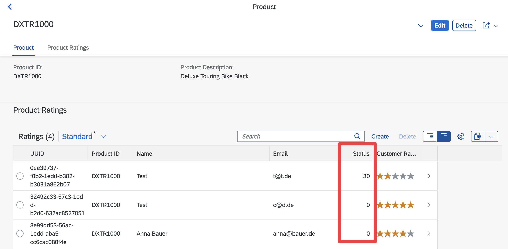
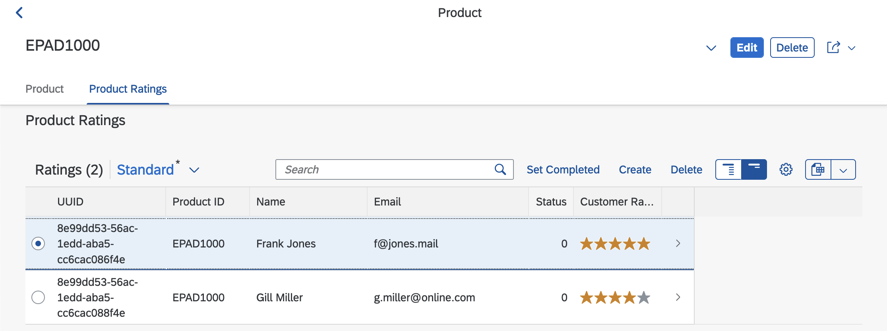
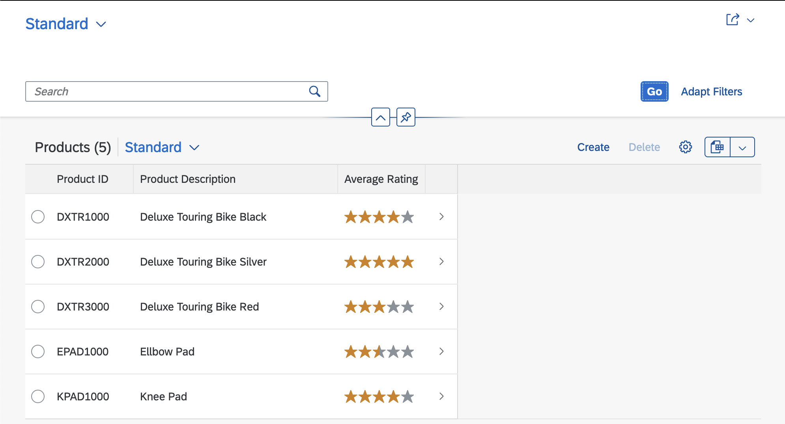
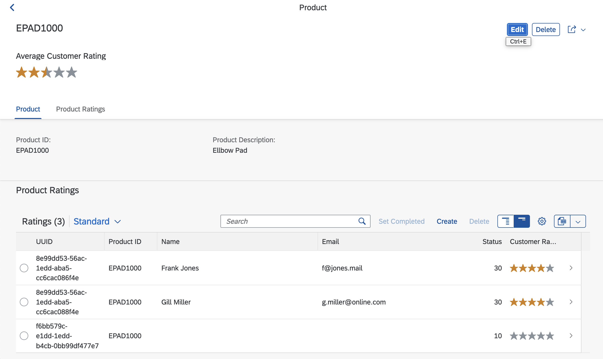

# Adding Behavior

In the [previous unit](./transactional_app.md), we added the first functionality to the business object
by defining the [CRUD](https://en.wikipedia.org/wiki/Create,_read,_update_and_delete) operations
available. In this unit, we will extend the functionality of the business object by adding additional behaviors
such as validations, determinations, and actions.

[Validations](https://help.sap.com/docs/btp/sap-abap-restful-application-programming-model/validations) are
implemented to check the data entered by the user. For example, consider the email address of a user. Validation can be used to check if a valid email address was entered.
[Determinations](https://help.sap.com/docs/btp/sap-abap-restful-application-programming-model/determinations)
are used to change the business object data based on trigger conditions. Finally, 
[actions](https://help.sap.com/docs/btp/sap-abap-restful-application-programming-model/actions) are added
to allow the user to trigger an operation on the business object.

## Extending the Data Model

Before adding additional behavior to the business object, we need to extend its data model.

### Adding a Status Field

To implement additional behaviors a status field is added to the rating business object. This field
is used to indicate the processing status of a rating.
First, a rating is in the status _New_. Once the customer provided a rating, i.e. rating value and an
optional review, the status is _Customer Review_. If the review was checked by a product manager, the status
is changed to _Completed_.

#### Exercise 1

To add a status field to the business object, perform the following steps:

1. Create a domain `ZD_STATUS` in the package `Z_RATING_DB`. The domain should allow the following values:
   | Fixed Values | Description |
   | -----------: | --------------- |
   | 0 | undefined |
   | 10 | New |
   | 20 | Customer Review |
   | 30 | Completed |
1. Create a data element `ZE_STATUS` in the package `Z_RATING_DB`. The data element should use the domain `ZD_STATUS`.
1. Add a `status` field to the `ZRATING` table after the `review` field. The field should by of type `ZE_STATUS`
1. Add the `status` field to the `Z_I_Rating` view after the `Review` field and rename it to `Status`.
1. Add the `Status` field to the `Z_C_Rating_M` view and the `Z_C_Rating_M` metadata extension. The `Status` should be
   displayed in the ratings list on a product's object page.

If you completed Exercise 1, the resulting object page for a product should look similar to the following
screenshot:



Note that the status field contains the value `0` for all existing data in the app. In the next steps, we will add functionality
to change this value. Furthermore, the screenshot above shows the values in the `Customer Rating` column
as a rating indicator. We discussed how to achieve this in a [previous unit](./ro_list_report.md#beautifying-the-app). The following
snippet shows the necessary additions to the metadata extension `Z_C_Rating_M`.

```abap
...
  @UI:{
    lineItem: [{
        position: 50,
        type: #AS_DATAPOINT
    }],
    dataPoint: {
      qualifier: 'Rating',
      targetValue: 5,
      visualization: #RATING
    }
  }
  Rating;
...
```

## Adding Determinations

In this step, we will add functionality to automatically update the value of the status field
In RAP, we use
[determinations](https://help.sap.com/docs/btp/sap-abap-restful-application-programming-model/determinations)
to change the value of fields based on trigger conditions.

Determinations can be executed on `save` or on `modify`.
According to the [ABAP keyword documentation](https://help.sap.com/doc/abapdocu_cp_index_htm/CLOUD/en-US/index.htm?file=abenbdl_determinations.htm),
`on modify` specifies that the determination is executed immediately after data changes take place
in the transactional buffer so that the result is available during the transaction. In contrast,
`on save` specifies that the determination is executed during the save sequence at the end of a transaction
when changes in the transactional buffer are persistent on the database.

In both cases, the trigger condition can be one of the CRUD operations `create`, `update`, and `delete`. Furthermore, the changes
of a field value can also be used as a trigger condition.

In the behavior definition of `Z_I_Rating`, we have two determinations (cf. the following listing).
The determination `setStatusNew` is executed `on modify` whenever a new `Rating` is created to set the initial status value of a `Rating`.
The determination `setStatusCustomerFeedback` is executed `on modify` whenever the value of the field `Rating` changes.
In this case, the status field is set to the value `20` whenever a rating value is provided.

```abap
define behavior for Z_I_Rating alias Rating
persistent table zrating
lock dependent by _Product
authorization dependent by _Product
{
  update;
  delete;
  field ( readonly ) Product;
  association _Product;

  field ( readonly, numbering : managed ) RatingUUID;
  field ( readonly ) LastChangedAt, LastChangedBy, CreatedAt, CreatedBy;

  determination setStatusNew on modify {create; }
  determination setStatusCustomerFeedback on modify { field Rating; }

  mapping for zrating corresponding
    {
      RatingUUID    = rating_uuid;
      LastChangedAt = last_changed_at;
      LastChangedBy = last_changed_by;
      CreatedAt     = created_at;
      CreatedBy     = created_by;
    }
 }
```

Adding the determination to the behavior definition is only the first step.
The implementation of these determinations is still missing. The little light bulb icon
in the editor shows, that a quick fix is available. Clicking on the light bulb icon
or pressing `<ctrl> + 1` will apply the quick fix.

After executing the quick fix for determination `setStatusNew...`, a method `SetStatusNew` is created in the local class `lhc_rating`
inside the class `Z_BP_I_Product`, which implements the behaviors for `Z_I_Product`. Before implementing the method, we recommend
renaming it to `set_status_new` to conform with common ABAP naming conventions. The resulting method declaration is as follows:

```abap
...
METHODS set_status_new FOR DETERMINE ON MODIFY
      IMPORTING keys FOR Rating~setStatusNew.
...
```

The implementation of the method `set_status_new` is shown in the following listing:

```abap
METHOD set_status_new.
    DATA ratings_for_update TYPE TABLE FOR UPDATE Z_I_Rating.

    READ ENTITIES OF Z_I_Product IN LOCAL MODE
     ENTITY Rating
       FIELDS ( Status )
       WITH CORRESPONDING #( keys )
     RESULT DATA(ratings).

    DELETE ratings WHERE Status IS NOT INITIAL.
    CHECK ratings IS NOT INITIAL.

    LOOP AT ratings ASSIGNING FIELD-SYMBOL(<rating>).
      APPEND VALUE #( %tky = <rating>-%tky
                      status = rating_status-new )
             TO ratings_for_update.
    ENDLOOP.

    MODIFY ENTITIES OF Z_I_Product IN LOCAL MODE
      ENTITY Rating
        UPDATE FIELDS ( Status )
        WITH ratings_for_update
      REPORTED DATA(update_reported).

    reported = CORRESPONDING #( DEEP update_reported ).

  ENDMETHOD.
```

It should be obvious that the implementation of `set_status_new` is not plain ABAP but instead contains
[Entity Manipulation Language (EML)](https://help.sap.com/docs/btp/sap-abap-restful-application-programming-model/entity-manipulation-language-eml)
statements. EML is an extension to the ABAP language that enables access to RAP business objects.
While a complete introduction to EML is beyond the scope of this curriculum, we will
explain the EML elements necessary to implement the requirement of the example app.
The implementation of the `set_status_new` method performs the following operations:

1. The variable `ratings_for_update` is defined as a `TABLE FOR UPDATE` with the structure `Z_I_Rating`.
   A `TABLE FOR UPDATE` is a table type with a special structure for working with ABAP RAP objects. The main features off
   these table types are:
   - Enabled for data in RAP
   - Containing [special components](https://help.sap.com/doc/abapdocu_cp_index_htm/CLOUD/en-US/index.htm?file=abapderived_types_comp.htm) like
     %tky.
     Details on these special components can be found in the
     [ABAP documentation](https://help.sap.com/doc/abapdocu_cp_index_htm/CLOUD/en-US/index.htm?file=abapderived_types_comp.htm)
     or in the [EML cheat sheet](https://github.com/SAP-samples/abap-cheat-sheets/blob/main/08_EML_ABAP_for_RAP.md).
1. The `READ ENTITIES` EML statement is used to read the value of the `Status` field for all elements in the importing parameter `keys`.
   This parameter contains the primary key of all created entities. Note that the design of ABAP RAP and EML focuses on mass data. Therefore, all
   operations are always operations on multiple objects. Working with just one object is a special case. The result of the
   `READ ENTITIES` EML statement is stored in the variable `ratings`.
1. All ratings that already have a `Status` value are deleted from the internal table `ratings`. This is done to ensure no values are overwritten with the
   default value. The `CHECK` statement ensures that the processing only continues if the are still entries in the variable `ratings`.
1. In the `LOOP`, a new entry is added to `ratings_for_update`. This entry contains the values of the special component `%tky` and
   the default value `rating_status-new` for the status. Setting the default value uses the following constant defined in the header of
   `lhc_rating`.
   ```abap
   ...
   CONSTANTS:
      BEGIN OF rating_status,
        new               TYPE i VALUE 10,
        customer_feedback TYPE i VALUE 20,
        completed         TYPE i VALUE 30,
      END OF rating_status.
   ...
   ```
1. The `MODIFY ENTITIES` statement updated the transactional buffer for all changed ratings, i.e. the entries in
   `ratings_for_update`. Any error messages occurring during the modification of the entities will be returned in the
   `REPORTED` parameter. In this example, these errors are returned from the method.

The implementation for the determination `determination setStatusCustomerFeedback` is still missing. Create it using the quick fix
of the behavior and rename the generated method to `set_status_customer_feedback`. The implementation of the method
should be as follows:

```abap
 METHOD set_status_customer_feedback.
    READ ENTITIES OF Z_I_Product IN LOCAL MODE
     ENTITY Rating
       FIELDS ( Status Rating )
       WITH CORRESPONDING #( keys )
     RESULT DATA(ratings).

    DELETE ratings WHERE Rating = 0.
    CHECK ratings IS NOT INITIAL.

    MODIFY ENTITIES OF Z_I_Product IN LOCAL MODE
      ENTITY Rating
        UPDATE FIELDS ( Status )
        WITH VALUE #( for rating in ratings
                          ( %tky = rating-%tky
                            status = rating_status-customer_feedback ) )
      REPORTED DATA(update_reported).

    reported = CORRESPONDING #( DEEP update_reported ).
  ENDMETHOD.
```

This implementation uses a different approach to the implementation of `set_status_new`. Instead of creating auxiliary variables
for the changed entities, the necessary table is created implicitly using a `VALUE` statement. Below is an explanation of the code.

1. The `READ ENTITIES` EML statement is used to read the value of the `Status` and `Rating` fields for all elements in the importing parameter `keys`.
   The result of the `READ ENTITIES` EML statement is stored in the variable `ratings`. Note that all EML operations are always executed
   for multiple objects.
1. All entities with an initial value of `0`in the `Ratings` field are deleted from the `ratings` table. The method continues only
   if still entries are left in the `ratings` table.
1. The value of the `Status` field of the remaining entities is set to `rating_status-customer_feedback`. A `#VALUE` statement together with
   a [`FOR` expression](https://help.sap.com/doc/abapdocu_latest_index_htm/latest/en-US/index.htm?file=abenfor.htm) is used to build
   the necessary update table (cf. table `ratings_for_update` in the previous listing). Any errors occurring during the update are reported and returned
   from the method.

### Exercise 2

To test the effect of the new behaviors on the app, create a new rating and check the status after the creation. Next, change the
value of the `Rating` field and check the status again. Also, verify the data that is stored in the database table `ZRATING`.

To understand how the behavior implementations work, debug the code. When are the behaviors triggered? How many entities are passed via the `keys` parameter?

## Adding Validations

Currently, there is no validation in place for the values entered in the fields of the app,
such as checking whether the entered email address is valid or if the entered rating value is between 0 and 5.
However, we can implement validations in a business object using
[validations](https://help.sap.com/docs/btp/sap-abap-restful-application-programming-model/validations).

The following code snippet can be used to add two validations, `checkEmail` and `checkRating`, to the business object `Z_I_Rating`.

```abap
...
  validation checkEmail on save { field Email; }
  validation checkRating on save { field Rating; }
...
```

The validations are executed when the business object is saved. A validation when the business object is changed is not possible.
Trigger conditions can be specified on the CRUD operation
`create`, `update`, and `delete`, or the modification of a field. In the code snippet above, both conditions are triggered by the modification of a field value.

To create the implementation of the validations in the class `ZBP_I_Product`, we can use a quick fix again.
Once generated, we can rename the generated methods to `check_email` and `check_rating` respectively.

The following listing shows the implementation of the `check_email` method. It performs a simple validation of email addresses using the
[regular expression](https://en.wikipedia.org/wiki/Regular_expression)
`^[\w\.=-]+@[\w\.-]+\.[\w]{2,3}$`.
The implementation performs the following steps:

1. Read the `Email` field for all `Rating` entities with a primary key in `keys` using the EML `READ ENTITIES` statement.
1. Create an instance of `cl_abap_matcher` using one of the methods of `cl_abap_regex`.
1. Loop through all `Rating` entities in `rating`. For each `Rating` entity, check the `Email` field using the
   regular expression. When the email conforms to the regular expression `match( )` returns `abap_true`
   (i.e., the result is `NOT INITIAL`).
1. If the email does not conform to the regular expression, the key of the entity is appended to the
   `failed-rating` table and an error message is added to the `reported-rating` table. The error
   message is created using the message class `ZM_RATING_M`. The message with the number `001`
   contains the following text `&1 is not an email address. Please enter a valid email address.`.

```abap
METHOD check_email.
    READ ENTITIES OF Z_I_Product IN LOCAL MODE
      ENTITY Rating
        FIELDS ( Email )
        WITH CORRESPONDING #( keys )
      RESULT DATA(ratings).

    DATA(email_regex) =
      cl_abap_regex=>create_pcre(
      pattern     = '^[\w\.=-]+@[\w\.-]+\.[\w]{2,3}$'
      ignore_case = abap_true ).

    LOOP AT ratings ASSIGNING FIELD-SYMBOL(<rating>).
      DATA(matcher) = email_regex->create_matcher( text = <rating>-email ).
      IF matcher->match(  ) IS INITIAL.
        APPEND VALUE #( %key = <rating>-%key ) TO failed-rating.

        APPEND VALUE #( %key = <rating>-%key
                        %msg = new_message( id      = 'ZM_RATING_M'
                                            number  = '001'
                                            v1      = <rating>-email
                                            severity = if_abap_behv_message=>severity-error )
                       %element-email = if_abap_behv=>mk-on ) TO reported-rating.
      ENDIF.
    ENDLOOP.
  ENDMETHOD.
```

### Exercise 3

Implement the `check_rating` method. The method should check if the rating value is between 0 and 5.
If the rating value is outside the range, a suitable error message should be raised. After implementing the method test, the app and make
sure that the validations work as expected.

## Adding Operations and Feature Control

To complete the behavior of the business object `Z_I_Rating`, the following features are missing. First, it should be possible to set
the status of one or several Ratings to `completed`. Currently, this is only possible by editing the status field of the individual Rating entities.
Furthermore, once the status of a Rating has been set to `completed`, no change or deletion of the Rating entity should be allowed.

To achieve this behavior custom operations and feature controls are required.

### Adding Operations

The business objects `Z_I_Product` and `Z_I_Rating` already support the
[standard operations](https://help.sap.com/docs/btp/sap-abap-restful-application-programming-model/standard-operations)
provided by SAP RAP. These standard operations are, for example, [create](https://help.sap.com/docs/btp/sap-abap-restful-application-programming-model/create-operation),
[update](https://help.sap.com/docs/btp/sap-abap-restful-application-programming-model/update-operation) and
[delete](https://help.sap.com/docs/btp/sap-abap-restful-application-programming-model/delete-operation) operations. In addition to the
standard operations custom business logic can be added to a business object using nonstandard operations. SAP RAP offers two types of nonstandard
operations: [actions](https://help.sap.com/docs/btp/sap-abap-restful-application-programming-model/actions) and
[functions](https://help.sap.com/docs/btp/sap-abap-restful-application-programming-model/functions). While actions enable the modification of
the business object, functions provide custom read operations.

To enable changing the status of a `Rating` entity using an action, the following steps are necessary:

1. Define the action in the behavior.
1. Implement the action.
1. Add the action to the app using an annotation.

The following listing shows the definition of the action `setStatusToCompleted` in the behavior `Z_I_Rating`.
The action specifies that one result is returned by the action and that the type of this result is the same as the entity (`$self`).

```abap
...
action setStatusToCompleted result [1] $self;
...
```

In addition to that, the usage of the action also needs to be defined in the behavior for `Z_C_Rating_M`.

```abap
...
use action setStatusToCompleted;
...
```

Next, the quick fix of the action can be used to generate an initial implementation of the action in `ZBP_I_Product`. Again, the definition
of the method should be renamed to `set_status_to_completed`. The following listing shows the implementation of the action. Most of the code
should look familiar by now. First, the rating entities are read using the `keys` table. Next, the status for each entity is set to
`rating_status-completed`. Finally, the changed entities are read again and returned for the method.

```abap
METHOD set_status_to_completed.
    READ ENTITIES OF z_i_product IN LOCAL MODE
     ENTITY rating
       FIELDS ( status )
       WITH CORRESPONDING #( keys )
     RESULT DATA(ratings).

    MODIFY ENTITIES OF z_i_product IN LOCAL MODE
       ENTITY rating
         UPDATE FIELDS ( status )
         WITH VALUE #( FOR rating IN ratings
                       ( %tky = rating-%tky
                         status = rating_status-completed ) ).

    READ ENTITIES OF z_i_product IN LOCAL MODE
     ENTITY rating
       ALL FIELDS
       WITH CORRESPONDING #( keys )
     RESULT DATA(completed_ratings).

    result = VALUE #( FOR rating IN completed_ratings ( %tky = rating-%tky
                                                        %param = rating ) ).
  ENDMETHOD.
```

To use the action in the app, it also needs to be added to the UI. There are different options for triggering the action. To add the action
to the table of ratings, the following annotations can be used. This annotation adds a `Set Completed` action.

```abap
@UI.lineItem: [{ position: 44 },
                 { type: #FOR_ACTION,
                   dataAction: 'setStatusToCompleted',
                  label: 'Set Completed'}]
  Status;
```

The result of the previous steps is shown in the following screenshot.



#### Exercise 4

Validate, that the newly implemented action has the desired effect.

Additionally, Add a button to trigger the action to the object
page of a rating.

### Adding Feature Control

To prevent changes to a rating entity once its status is set to `completed`, 
we can implement [feature control](https://help.sap.com/docs/btp/sap-abap-restful-application-programming-model/feature-control)
to the business object.

Dynamic feature control can be enabled for standard as well as nonstandard operations. The following example demonstrates
how to extend the behavior `Z_I_Rating` to enable dynamic feature control for the `update`, `delete`, and
`setStatusToCompleted` actions.

```abap
...
  update ( features : instance );
  delete ( features : instance );

  ...

  action ( features : instance ) setStatusToCompleted result [1] $self;
```

After adding `(features : instance)` to the operations, you can use a quick fix
to generate an implementation of the feature control in `ZBP_I_Product`.
The following listing shows the feature control implementation for this case.
First, the entities are read first using the keys table. For each operation, the status of
the entity is checked. If the status is `30` (i.e., completed) the operations are disabled
using the constant `if_abap_behv=>fc-o-disabled`. Otherwise, the status is set to `if_abap_behv=>fc-o-enabled`.

```abap
  METHOD get_instance_features.
    READ ENTITIES OF z_i_product IN LOCAL MODE
       ENTITY rating
         FIELDS ( status )
         WITH CORRESPONDING #( keys )
       RESULT DATA(ratings).

    result = VALUE #( FOR rating IN ratings
                    ( %tky = rating-%tky

                      %features-%action-setStatusToCompleted =
                        COND #( WHEN rating-Status = 30
                                THEN if_abap_behv=>fc-o-disabled ELSE if_abap_behv=>fc-o-enabled  )

                      %features-%delete =
                        COND #( WHEN rating-Status = 30
                                THEN if_abap_behv=>fc-o-disabled ELSE if_abap_behv=>fc-o-enabled   )

                      %features-%update =
                        COND #( WHEN rating-Status = 30
                                THEN if_abap_behv=>fc-o-disabled ELSE if_abap_behv=>fc-o-enabled   )
                   ) ).
  ENDMETHOD.
```

After implementing the feature control, the actions to change a rating are only available if the status of the rating is not `30`.
Verify this by testing the app again.

## Adding Virtual Elements

One missing feature is the calculation of an average rating for a product. Currently, only the
individual ratings are stored, but no average rating is calculated.
Several approaches are possible, such as storing the average rating in the database and updating it whenever a new rating is added.
The approach used here calculates the average rating when necessary by adding a
[virtual element](https://help.sap.com/docs/btp/sap-abap-restful-application-programming-model/using-virtual-elements-in-cds-projection-views)
to the business object.

The following listing demonstrates how to add the virtual element called `Average Rating` to the business object projection `Z_C_Product_M`.
The statement `virtual AverageRating: abap.dec( 2, 1 )` defines the virtual Element as a decimal number of length two and one decimal digit.
The annotation `@ObjectModel.virtualElementCalculatedBy` defines that the virtual element is calculated in the ABAP class
`ZCL_VE_AVERAGE_RATING`. This class needs to implement the interface ` if_sadl_exit_calc_element_read`.

```abap
define root view entity Z_C_Product_M
  as projection on Z_I_Product
{
  key ProductId,
      ProductDescription,

      @ObjectModel.virtualElementCalculatedBy: 'ABAP:ZCL_VE_AVERAGE_RATING'
      @EndUserText.label: 'Average Customer Rating'
      virtual AverageRating: abap.dec( 2, 1 ),

      /* Associations */
      _Rating : redirected to composition child Z_C_Rating_M
}
```

The implementation of the method `if_sadl_exit_calc_element_read~calculate` is presented in the listing below.
The familiar `READ ENTITIES` statement is used to read the Ratings of a Product. Note that the association
`_Rating` is utilized to read all ratings of a product. Additionally,
the input parameter `it_original_data` of `if_sadl_exit_calc_element_read~calculate` does not posses the right structure for the
`READ ENTITIES` statement. Consequently, a mapping to the type `Z_C_Product_M` is performed at the beginning of the method.

After reading the Ratings for a Product, a `SELECT` statement on the internal table `ratings`, combined with
the aggregate function [`AVG`](https://help.sap.com/doc/abapdocu_latest_index_htm/latest/en-US/index.htm?file=abensql_agg_func.htm),
is used to calculate the average rating for each product.

Finally, the average rating for each product is added to the internal table `products`. The changed data is returned in the
changing parameter `ct_calculated_data`.

```abap
METHOD if_sadl_exit_calc_element_read~calculate.
    DATA products TYPE STANDARD TABLE OF Z_C_Product_M.
    products = CORRESPONDING #( it_original_data ).

    READ ENTITIES OF Z_C_Product_M
      ENTITY Product BY \_Rating
      FIELDS ( Rating )
      WITH CORRESPONDING #( products )
      RESULT FINAL(ratings).

    SELECT
      Product,
      AVG( rating AS DEC( 2, 1 ) ) AS average_rating
      FROM @ratings AS r
      GROUP BY Product
      INTO TABLE @DATA(average_product_ratings).

    LOOP AT products ASSIGNING FIELD-SYMBOL(<product>).
      READ TABLE average_product_ratings
        WITH KEY Product = <product>-ProductId
        INTO DATA(average_product_rating).
      IF sy-subrc = 0.
        <product>-AverageRating = average_product_rating-average_rating.
      ENDIF.
    ENDLOOP.

    ct_calculated_data = CORRESPONDING #( products ).
  ENDMETHOD.
```

Using the following annotation in the `Z_C_Product_M` metadata extension, the virtual element can be added to the UI of the app.

```abap
@UI:{
    lineItem: [{
        position: 30,
        importance: #HIGH,
        type: #AS_DATAPOINT,
        label: 'Average Rating'
    }],
    dataPoint: {
      qualifier: 'AverageRating',
      targetValue: 5,
      visualization: #RATING
    }
  }
  AverageRating;
```

The following screenshots show the app after adding the virtual element.





The following figure summarizes
the elements comprising the rating after the last step.


This concludes the unit. In the next unit, an outlook on possible next steps is given.

---

[< Previous Chapter](./transactional_app.md) | [Next Chapter >](./next_steps.md) | [Overview 🏠](../README.md)
