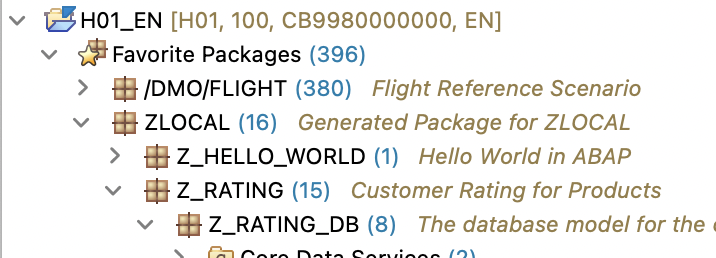
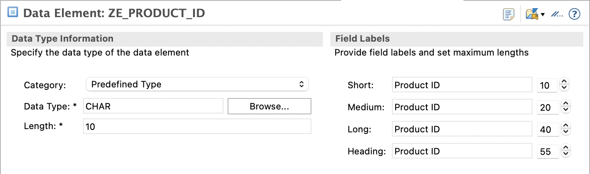
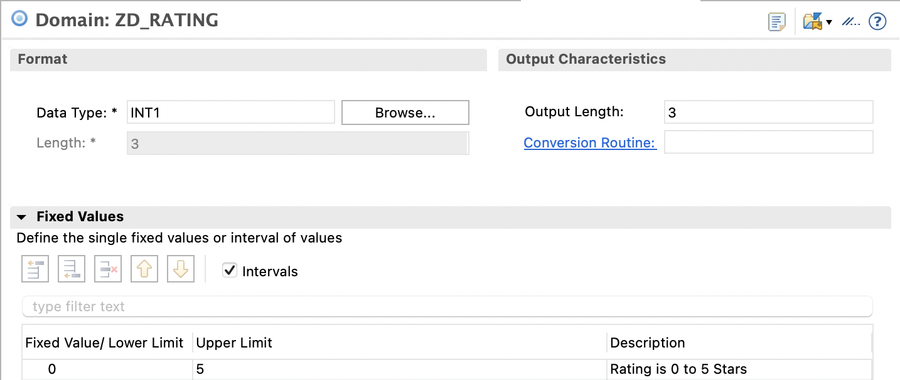
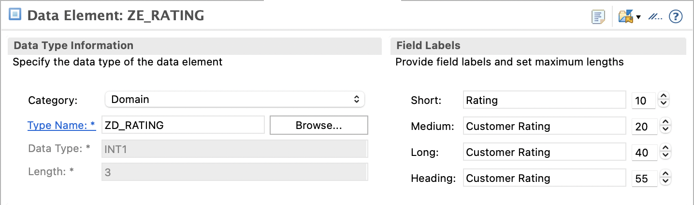
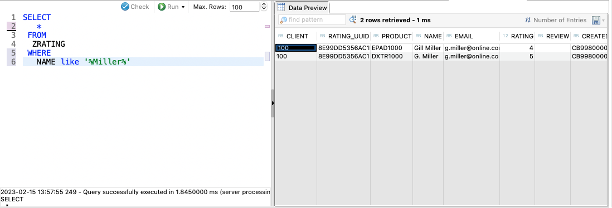
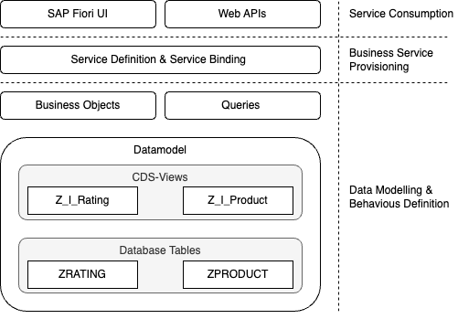
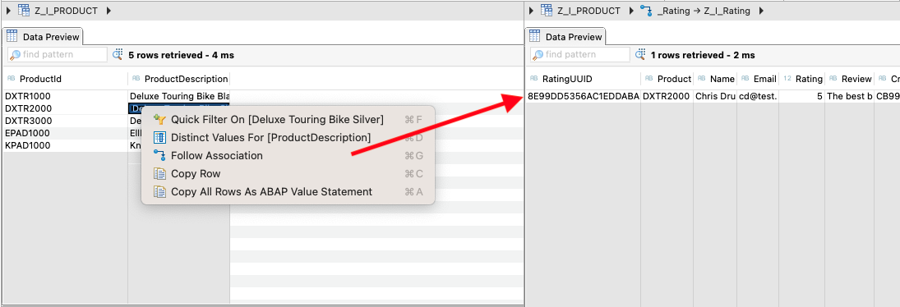

# Data Model of the Rating App

To begin the development of the Rating App, the data model must be created. This
model consists of two parts: table definitions and CDS views based on those tables.
CDS views provide additional semantic information on top of the database tables,
such as explicitly defining the relationship between tables (e.g. the 1:N relationship
between products and ratings, cf. [scenario description](./scenario.md)).

## Creating Packages

Before creating any repository objects, it's important to create a package to group
them together. For the data model, the following package structure is created within
the `ZLOCAL` package:

- `Z_RATING`: The package containing all development artifacts for the Rating App.
  - `Z_RATING_DB`: The database model of the Rating App. It should be created inside the `Z_RATING` package.

After creating these packages and adding `ZLOCAL` to the favorite packages, the package
structure should resemble the following screenshot:



## Creating Data Elements

When creating the database tables in the [next step](#creating-the-database-tables), mostly
[build in ABAP types](https://help.sap.com/doc/abapdocu_cp_index_htm/CLOUD/en-US/index.htm?file=abenddic_builtin_types.htm)
are used. Custom data elements are used for two reasons:

1. To define a foreign key relationship between the product and rating tables.
1. To restrict the possible values of a product's rating to a range of 0 to 5.

The first step is to create a data element for the primary key of the product table.
The data element is named `ZE_PRODUCT_ID` and is created inside the `Z_RATING_DB` package.
To create the data element, right-click on `Z_RATING_DB` and select `New > Other ABAP 
Repository Object`. In the dialog window, select _Data Element_ and click `Next`. Enter
`ZE_PRODUCT_ID` as the name and `Product ID` as the description of the data element.
Finally, select a transport request and click `Finish`.

This opens a editor to define the details of the data element. Define `ZE_PRODUCT_ID` as a
character field with the length of 10 characters as shown in the following screenshot.
Finally, save and activate the changes.



Restricting the possible values for a product's rating requires two steps. First,
create a domain with a data range. Second, define a data element using this domain.
To define a domain, right-click on the `Z_RATING_DB` package again and select `New

> Other ABAP Repository Object`. In the dialog window, select _Domain_ and click `Next`.
Enter `ZD_RATING`as the name and`Domain for Product Ratings`as the description of 
the domain. Finally, select a transport request and click`Finish`.

This opens an editor for creating domains. In this editor perform the following steps:

1. Set the data type of the domain to `INT1`, which is a 1-byte integer with a value
   range of 0 to 255.
1. To restrict the possible values of the domain, enter the range 0 to 5 in the `Fixed 
Values` section. Refer to the following screenshot for help.
1. Save and activate the changes.



Next, create a data element named `ZE_RATING` with the description `Customer Rating`.
To use the domain created in the previous step the category `Domain` needs to be selected.
The type name `ZD_RATING`.
Finally, save and activate the changes again.



## Creating the Database Tables

After defining the data elements, the next step involves creating database tables.
The data model for the Rating App comprises two tables: Product and Rating.

The Product table contains only the product ID and a description of the product,
as specified in the [scenario description](./scenario.md). To create the Product table, right-click
on the package `Z_RATING_DB` and select `New > Other ABAP Repository Object`. In the
dialog window, choose _Database Table_ and click `Next`. Enter `ZPRODUCT` as the table
name and `Product` as its description. Finally, select a transport request and click
`Finish`. Copy the following code into the editor, save, and activate the table.

```abap
@EndUserText.label : 'Product'
@AbapCatalog.enhancement.category : #NOT_EXTENSIBLE
@AbapCatalog.tableCategory : #TRANSPARENT
@AbapCatalog.deliveryClass : #A
@AbapCatalog.dataMaintenance : #RESTRICTED

define table zproduct {

  key client     : abap.clnt not null;
  key product_id : ze_product_id not null;
  product_desc   : abap.char(40);

}

```

The previous program code consist of the following elements:

- The define table statement defines the `ZPRODUCT` table.
- The `key` keyword specifies the primary key of the database table, comprising two fields: `client` and `product_id`.
  The `client` is a unique identifier of a client in the SAP S/4HANA system and is typically added as a primary keys
  to any table, except when the table should not be client-dependent.
- The `not null` keyword indicates that the primary key cannot be null.
- The data type of the `client` field is set to the built-in type `abap.clnt`.
- The data type of the `product_id` is the data element `ZE_PRODUCT_ID`.
- The `product_desc` field is a character field with a length of 40 characters.

Additionally, some annotations (starting with the `@` symbol) are added to the table
definition. The `@EndUserText.label` defines the short text label of the table, which
is displayed in the IDE, for example. The `@ABAPCatalog.deliveryClass` annotation identifies
the table as one containing application data (as opposed to customizing data). The
ABAP documentation offers a detailed description of each used annotation.

The Rating table stores the product rating, review text, customer name, and customer
address. The product is a foreign key relation to the primary key `PRODUCT_ID` of the
`ZPRODUCT` table. In addition to these fields from the scenario, the table should also
contain management data. For each entry, the user and timestamp for creation and
modification should be stored. The following code snippet can be used to create the table.

```abap
@EndUserText.label : 'Rating'
@AbapCatalog.enhancement.category : #NOT_EXTENSIBLE
@AbapCatalog.tableCategory : #TRANSPARENT
@AbapCatalog.deliveryClass : #A
@AbapCatalog.dataMaintenance : #RESTRICTED

define table zrating {

  key client      : abap.clnt not null;
  key rating_uuid : sysuuid_x16 not null;
  @AbapCatalog.foreignKey.screenCheck : false
  product         : ze_product_id
    with foreign key [0..*,1] zproduct
      where product_id = zrating.product;
  name            : abap.char(128);
  email           : abap.char(128);
  rating          : ze_rating;
  review          : abap.string(512);
  created_by      : syuname;
  created_at      : timestampl;
  last_changed_by : syuname;
  last_changed_at : timestampl;

}

```

The code snippet above creates a table containing the following elements:

- Annotations are included to set the end user label, table category, and so on.
- The key consists of the `client` and the `rating_uuid` of type `sysuuid_x16`. A
  rating record ID is not a simple number from a numbering scheme (such as a product
  ID) but rather a [universally unique identifier](https://en.wikipedia.org/wiki/Universally_unique_identifier).
- The `product` is defined using the data element `ZE_PRODUCT_ID`. Moreover, a foreign
  key relation to the table `ZPRODUCT` is established. This defines a 1:n relation
  between entries in the `ZPRODUCT` table and entries in the `ZRATING` table. The annotation
  `@AbapCatalog.foreignKey.screenCheck` is not relevant in the context of ABAP on the
  SAP BTP. However, it may still be added automatically when activating the directory object.
- The `name` and `email` fields are defined as character fields with a length of 128 characters.
- The `rating` field is defined using the data element `ZE_RATING`.
- The `review` field is a character field with a length of 512 characters.
- The `created_by` and `last_changed_by` fields store the user who created or changed
  an entry. The `syuname` data type is used for these elements.
- The `created_at` and `last_changed_at` fields store the timestamp when the entry
  was created or changed. The `timestampl` data type is used for these elements.

## Adding Data to the Database

For each table in the database, it is possible to display and browse the content
using the _Data Preview_ feature of the ABAP development tools. To open the data preview,
right-click on the table and select `Open With > Data Preview` or simply press
`<F8>` in the editor window of the table. However, since the database tables have just
been created, they do not contain any data yet. The next step is to write a small
program to create some data in the tables.

The class `ZCL_GENERATE_DATA` shown below can be used to generate some data. It implements
the `IF_OO_ADT_CLASSRUN` interface, allowing the class to be executed. In the main
method, the two methods `create_products` and `create_ratings` are called. Both methods
first empty the respective database table using a `DELETE FROM ...` statement. Afterwards,
dummy data is created and inserted using an `INSERT INTO ...` statement.
A [VALUE constructor expression](https://help.sap.com/doc/abapdocu_latest_index_htm/latest/en-US/index.htm?file=abenconstructor_expression_value.htm)
is used to create the dummy data.

Note that no `COMMIT WORK` statement is needed, as the commit occurs implicitly when executing the class.

```abap
CLASS zcl_generate_data DEFINITION
  PUBLIC
  FINAL
  CREATE PUBLIC .

  PUBLIC SECTION.

    INTERFACES if_oo_adt_classrun .
  PROTECTED SECTION.
    METHODS generate_products RETURNING VALUE(r_number_of_entries) TYPE i.
    METHODS generate_ratings RETURNING VALUE(r_number_of_entries) TYPE i.
  PRIVATE SECTION.
ENDCLASS.


CLASS zcl_generate_data IMPLEMENTATION.

  METHOD if_oo_adt_classrun~main.
    DATA(number_of_entries) = generate_products( ).
    out->write( |{ number_of_entries } products generated successfully!| ).

    number_of_entries = generate_ratings( ).
    out->write( |{ number_of_entries } ratings generated successfully!| ).
  ENDMETHOD.


  METHOD generate_products.
    DATA products TYPE TABLE OF zproduct.
    DELETE FROM zproduct.

    products = VALUE #(
        ( product_id = |DXTR1000| product_desc = |Deluxe Touring Bike Black| )
        ( product_id = |DXTR2000| product_desc = |Deluxe Touring Bike Silver| )
        ( product_id = |DXTR3000| product_desc = |Deluxe Touring Bike Red| )
        ( product_id = |EPAD1000| product_desc = |Ellbow Pad| )
        ( product_id = |KPAD1000| product_desc = |Knee Pad| )
    ).

    INSERT zproduct FROM TABLE @products.
    RETURN sy-dbcnt.
  ENDMETHOD.

  METHOD generate_ratings.
    DATA ratings TYPE TABLE OF zrating.

    DELETE FROM zrating.

    GET TIME STAMP FIELD DATA(current_ts).

    ratings = VALUE #(
        ( rating_uuid = cl_system_uuid=>create_uuid_x16_static( )
          rating = 4
          product = |DXTR1000|
          name = |Anna Bauer|
          email = |anna@bauer.de|
          review = |The color of the bike is not very durable.|
          created_at = current_ts
          created_by = sy-uname
          last_changed_at = current_ts
          last_changed_by = sy-uname
          )
        ( rating_uuid = cl_system_uuid=>create_uuid_x16_static( )
          rating = 5
          product = |DXTR2000|
          name = |Chris Drumm|
          email = |cd@test.de|
          review = |The best bike on the market!|
          created_at = current_ts
          created_by = sy-uname
          last_changed_at = current_ts
          last_changed_by = sy-uname
          )
        ( rating_uuid = cl_system_uuid=>create_uuid_x16_static( )
          rating = 3
          product = |DXTR3000|
          name = |Eve Smith|
          email = |es@email.com|
          created_at = current_ts
          created_by = sy-uname
          last_changed_at = current_ts
          last_changed_by = sy-uname
          )
        ( rating_uuid = cl_system_uuid=>create_uuid_x16_static( )
          rating = 5
          product = |EPAD1000|
          name = |Frank Jones|
          email = |f@jones.mail|
          review = |Size varies quite a lot.|
          created_at = current_ts
          created_by = sy-uname
          last_changed_at = current_ts
          last_changed_by = sy-uname
          )
        ( rating_uuid = cl_system_uuid=>create_uuid_x16_static( )
          rating = 4
          product = |EPAD1000|
          name = |Gill Miller|
          email = |g.miller@online.com|
          created_at = current_ts
          created_by = sy-uname
          last_changed_at = current_ts
          last_changed_by = sy-uname
          )
        ( rating_uuid = cl_system_uuid=>create_uuid_x16_static( )
          rating = 5
          product = |DXTR1000|
          name = |G. Miller|
          email = |g.miller@online.com|
          created_at = current_ts
          created_by = sy-uname
          last_changed_at = current_ts
          last_changed_by = sy-uname
          )
    ).

    INSERT zrating FROM TABLE @ratings.

    RETURN sy-dbcnt.

  ENDMETHOD.

ENDCLASS.

```

Create the class `ZCL_GENERATE_DATA` in the `Z_RATING_DB` package and execute it. Instead
of simply copying the code of the class, write the code in the editor and use code
completion (`<CTRL><SPACE>`) to explore the code completion features of Eclipse and
the ADT. For example, it is possible to get the fields of a table line using code completion.

After executing the class, the data preview of the `ZRATING` table should look similar to the screenshot below.


Note that is possible to open a SQL console from the data preview. This SQL console enables the execution of
complex `SELECT` statements on the tables in the database.



## Create CDS Views for the Database Tables

The next step is to add semantic information to the database tables. This is done using CDS views.

To create a CDS view, right-click on the package `Z_RATING_DB`, and select `New > Other 
ABAP Repository Object`. Choose _Data Definition_ in the dialog window and click `Next >`.
Name the CDS view `Z_I_Rating` and provide the description `Rating view`. Click `Next >`
to select a transport request and `Next >` to choose a template.

The `_I_` in the view's name signifies that it is an _Interface View_, providing
a stable interface to the underlying data model. Further discussion on different
views for the same database table is available later in the text.

Each business object needs a root node, which will be created based on these CDS
views. Since the business objects are simple and only consist of root nodes, select
the template _Define Root View Entity_ and click `Finish`.

Modify the code generated by the template to match the code below:

```abap

@AccessControl.authorizationCheck: #NOT_REQUIRED
@EndUserText.label: 'Product View'

define root view entity Z_I_Product
  as select from zproduct
{
}
```

Place the cursor between the curly braces and use code completion (`<CTRL><SPACE>`)
to add all elements of the database table `Z_RATING` to the view. The result should
resemble the following code:

```abap

@AccessControl.authorizationCheck: #NOT_REQUIRED
@EndUserText.label: 'Product View'

define root view entity Z_I_Product
  as select from zproduct
{
  key product_id   as ProductId,
      product_desc as ProductDescription,
}
```

Note, that the `client` field is not added to the view. The ABAP runtime takes care of handling the `client` field, i.e.
allowing only access to the data of the current client. Therefore, this field is not needed in the view. Besides this simplification
the view is the same as the table `Z_RATING`. Furthermore, the field names have been remanded to more user friendly names. These names are only a suggestion and can be changed if needed.

Next, add relationship information to the view with the code snippet below.
The line starting with `composition` defines a 0:n relationship between the entries
of the view `Z_I_Product` and the view `Z_I_Rating`. This relationship is named `_Rating`
and is also added to the view. The composition relation specifies also, that every rating is always related to exactly one
condition of the association. This information is used by the SAP RAP framework to e.g. enable or disable certain features for an entity.

Please note that the view `Z_I_Rating` has not been defined yet, so it is not possible
to activate the `Z_I_Product` view at this time.

```abap

@AccessControl.authorizationCheck: #NOT_REQUIRED
@EndUserText.label: 'Product View'

define root view entity Z_I_Product
  as select from zproduct
  composition [0..*] of Z_I_Rating as _Rating
{
  key product_id   as ProductId,
      product_desc as ProductDescription,
      _Rating
}
```

Now, create the CDS view `Z_I_Rating` using the complete code below. Instead of copying
and pasting, attempt to create the view using a template and code completion.

The view `Z_I_Rating` includes all fields of the underlying database table and defines
a 1:1 association to the view `Z_I_Product`. Each entry in the Rating view is related
to exactly one Product. Note, that the `Z_I_Rating` is defined by `define view entity` instead
of `define root view entity`. In any parent-child-relationship specified using the
`composition` ans `association to parent` keywords, there is only one root entity. All other
entities are dependent on this root entity.
The `$projection.ProductId = _Rating.Product` sets the condition of the 1:1 association. This
statement is functioning similarly to the where condition of a database join statement.

The `Z_I_Rating` view contains additional semantic information through annotations.
Annotations like `@Semantics.user.createdBy` and `@Semantics.user.lastChangedBy` identify
the fields that store the user who created or changed the entry. Similarly,
`@Semantics.systemDateTime.createdAt` and `@Semantics.systemDateTime.lastChangedAt` identify the
fields that store the date and time when the entry was created or last changed. While
these annotations currently have no visible effect, they will be utilized by the
ABAP RAP framework to automatically populate and update those fields once a business
object is created based on this view.

```abap
@AccessControl.authorizationCheck: #NOT_REQUIRED
@EndUserText.label: 'Rating View'

define view entity Z_I_Rating
  as select from zrating
  association [1..1] to parent Z_I_Product as _Product on $projection.Product = _Product.ProductId
{
  key rating_uuid     as RatingUUID,
      product         as Product,
      name            as Name,
      email           as Email,
      rating          as Rating,
      review          as Review,
      @Semantics.user.createdBy: true
      created_by      as CreatedBy,
      @Semantics.systemDateTime.createdAt: true
      created_at      as CreatedAt,
      @Semantics.user.lastChangedBy: true
      last_changed_by as LastChangedBy,
      @Semantics.systemDateTime.lastChangedAt: true
      last_changed_at as LastChangedAt,
      _Product
}
```

After saving both views, activate them using the `Activate inactive ABAP dvelopment objects`
button ().

The following figure illustrates the relationship between the created development
objects and the elements of the ABAP RAP. So far, only the data model has been created.



## Explore Data using CDS Views

The data preview of the `Z_I_Product` view is similar to that of the `ZPRODUCT` table, with two main differences:

- The `client` field is not part of the view.
- The field names have been changed to more user-friendly names.


The primary distinction becomes apparent when right-clicking on an entry and selecting
`Follow association.` This action opens a dialog window in which the association to
follow can be chosen. By selecting the `_Rating` association, it becomes possible to
navigate to all ratings for a particular product. The SQL console can be used to
analyze the SQL statement employed to select the associated entries.



Navigation in the opposite direction is also feasible: from any rating, it is possible
to navigate to the rated product.

This functionality is enabled by the association information added to the view. In
the next step, the RAP framework will use this information to automatically create
a basic UI for the data in the tables.

---

[< Previous Chapter](./scenario_description.md) | [Next Chapter >](./ro_list_report.md) | [Overview 🏠](../README.md)
