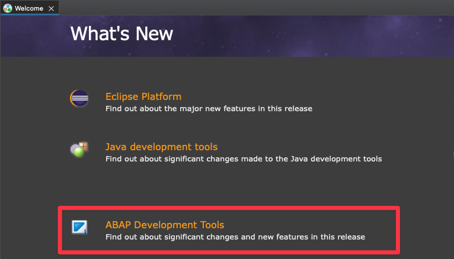
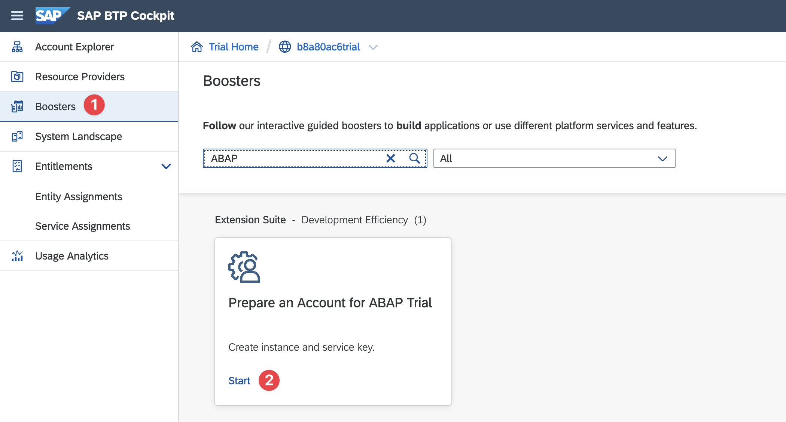
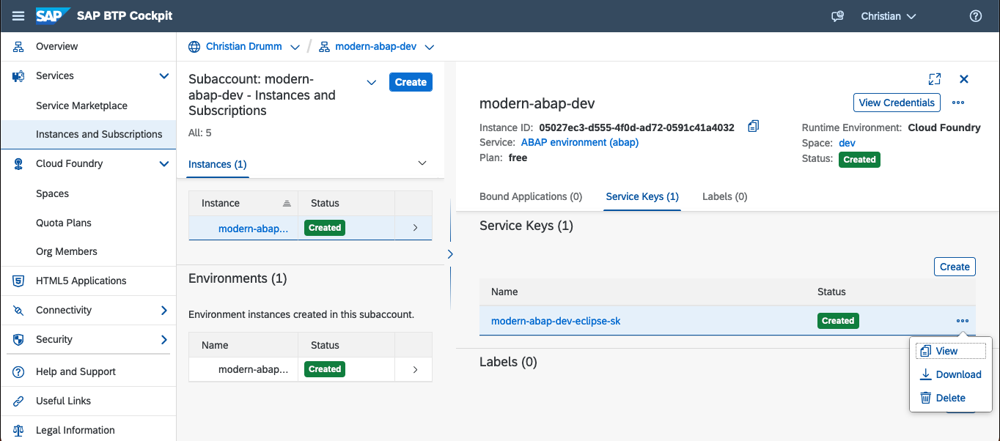

# ABAP Hello World

The goal of this lecture is set up the necessary development environment for ABAP development.
This development environment consists of several components. The following sections provide links
to documents describing the installation or set-up of theses components.

In particular the development environment for the remainder of the lecture consist of:

- a local installation of the [Eclipse IDE](https://www.eclipse.org/ide/) including the
  [ABAP Development Tools](https://tools.hana.ondemand.com/#abap) for ABAP development
- an instance of the [SAP Business Technology Platform](https://www.sap.com/products/technology-platform/)
  free tier
- an instance of the [SAP BTP ABAP environemt](https://discovery-center.cloud.sap/serviceCatalog/abap-environment?region=all&tab=feature&commercialModel=payg)

At the end of this lecture the usual [Hello World](https://en.wikipedia.org/wiki/%22Hello,_World!%22_program) program to ensure the development environment is ready.

## Installing Eclipse and the ABAP Development Tools

The first step to set up the development environment is to install the Eclipse IDE. There are several possible options.
Either download the [Eclipse Installer](https://www.eclipse.org/downloads/) and execute it or
install the suitable [package](https://www.eclipse.org/downloads/packages/) for your system.
On macOS and Linux it is also possible to use a package manager like [Homebrew](https://brew.sh/) or
[APT](<https://en.wikipedia.org/wiki/APT_(software)>).

Once the Eclipse IDE is installed the ABAP Developer Tools plug-ins need to be added. The necessary steps
are described [here](https://tools.hana.ondemand.com/#abap). Basically the following steps need to be
performed:

1. Inside the Eclipse IDE open the menu `Help > Install New Software...`
1. Enter the following URL https://tools.hana.ondemand.com/latest and press `Enter`
   to display the available features.
1. Select ABAP Development Tools and install them.

Once the installation has completed the Eclipse IDE has to be restarted. After the
restart the Eclipse IDE should show a Welcome page similar to the one in the following
image. If the installation was successful, there should be an ABAP Development Tools entry
on the Welcome page. Note, that the Welcome page can always be open using the
menu `Help > Welcome`.

## SAP BTP Free Tier

In order to deploy the SAP Business Technology Platform ABAP Environment in the next step, first an
account in the SAP Business Technology Platform (BTP) is required. The
SAP BTP currently offers two possibilities to get a free account:

- SAP BTP Free Tier
- SAP BTP trial account.

The SAP BTP free tier is a productive SAP BTP account without any costs. In contrast
the SAP BTP trial account is a SAP BTP account with limited functionality. For this
lecture the usage of the SAP free tier is recommended.

Signing up for the SAP BTP free tier is described in this
[tutorial](https://developers.sap.com/tutorials/btp-free-tier-account.html).
The sign up requires a credit card for authentication.

The sign up for an SAP BTP trial account does not require a credit card. The
process is described in this [tutorial](https://developers.sap.com/tutorials/hcp-create-trial-account.html).

## Deploying the SAP BTP ABAP Environment

Deploying the SAP BTP ABAP environment is similar for both, the SAP BTP free tier and
the SAP BTP trial. In both cases a _Booster_ is available to deploy the ABAP
environment. A Booster is simply a wizard or script that executes the necessary
set up steps in the SAP BTP.

The respective Booster can be accessed from the SAP BTP Cockpit. The SAP BTP
Cockpit is available at the following URLs:

- SAP BTP Free Tier: https://account.hana.ondemand.com/
- SAP BTP Trial: https://account.hanatrial.ondemand.com/trial/

In the SAP BTP free tier the Booster is named _Prepare an Account for ABAP
Development (Free-Tier)_ (cf. the following screen shot).

In the SAP BTP trial the Booster is named _Prepare an Account for ABAP Trial_ (cf. the following screen shot).

Select the suitable ABAP Booster and execute it. After the booster is finished the
SAP BTP account is prepared for ABAP development. The booster created a new
subaccount in the global account. The instances and subscriptions in this
subaccount should look similar to the following screenshot. Note, that the
names of the subaccount, the instance and the environment might differ
depending on the parameters used in the booster.

> In some cases the creation of the instance fails. If this happens, the instances in the sub account
> are either empty or show an error:
> 
> If this happens the erroneous environment can be deleted and created again using the _Create_ button.
> In the instance creation dialog select _ABAP environment_ as Service and _free_ as the used Plan and
> choose a name for the instance. In the second step of the dialog add the email address of the user.
> Finally, click _Create_ to create the service.

## ABAP Hello World

Once the ABAP environment is ready the next step is to write the hello world program. To do this the
first step is to connect the ABAP Development to Eclipse to the ABAP environment. There are several
possible options to to this. The easiest way is to use the service key of ABAP environment.

