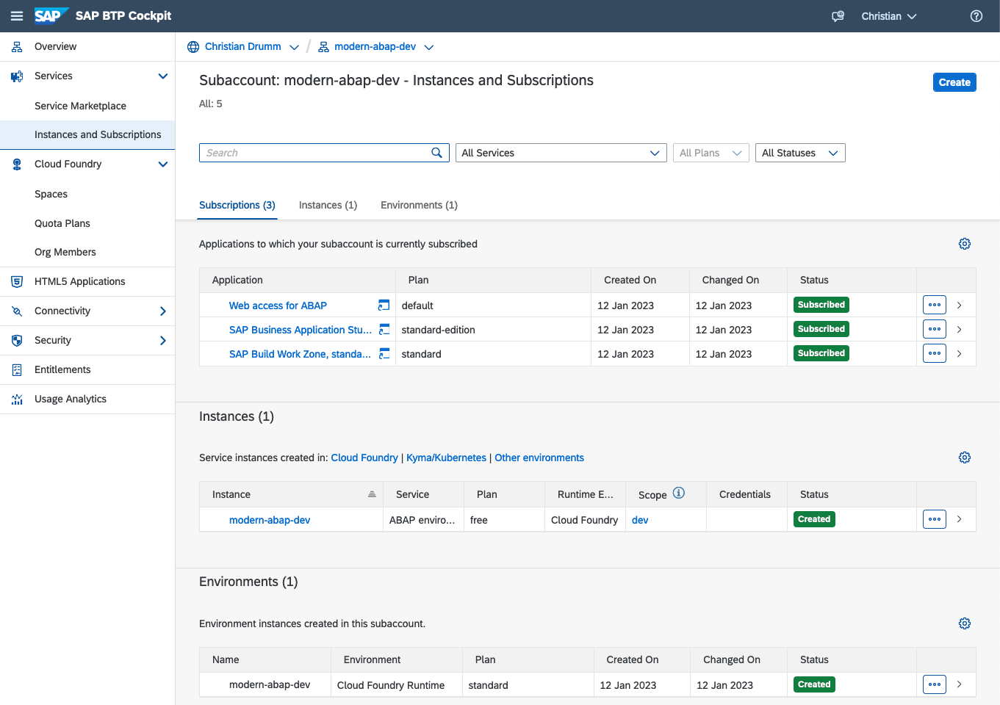
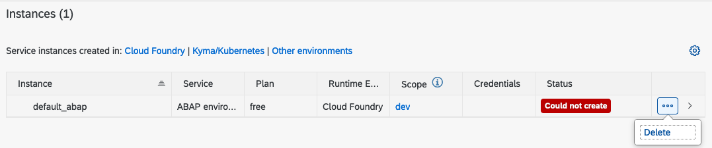
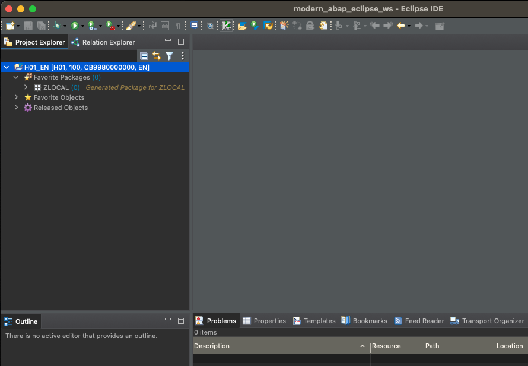
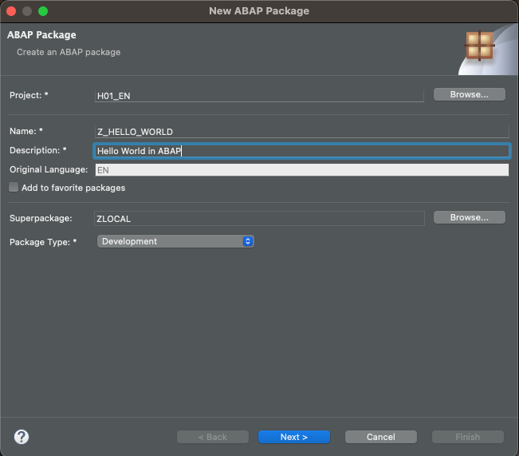
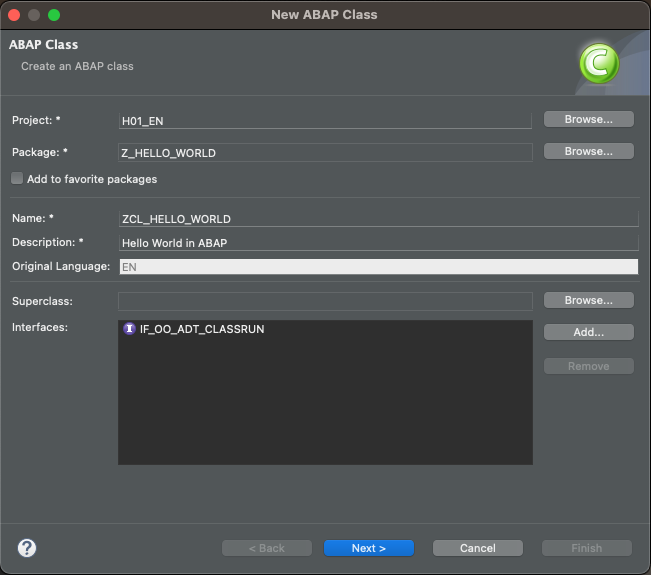
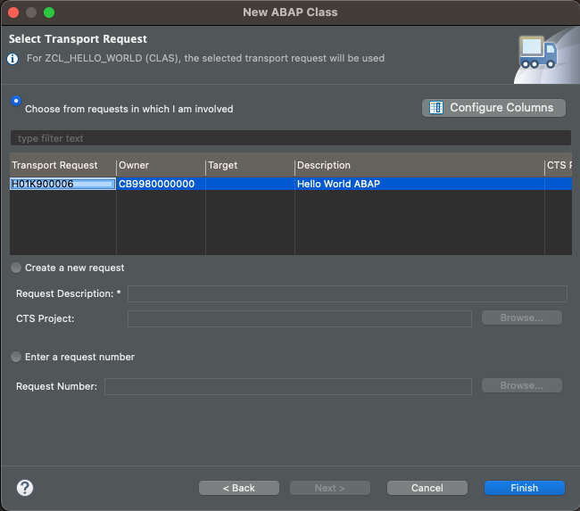
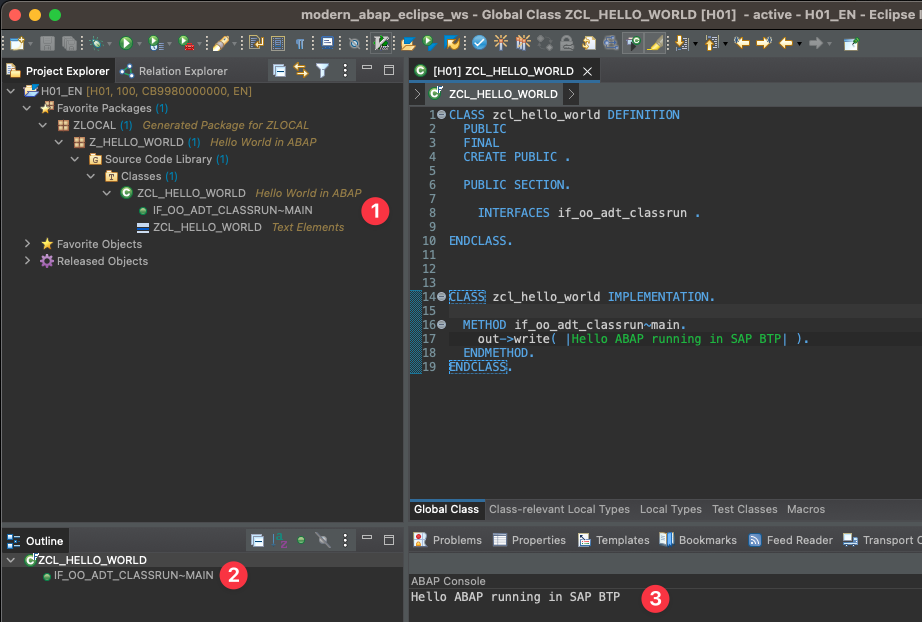

# ABAP Hello World

The goal of this lecture is set up the necessary development environment for ABAP development.
This development environment consists of several components. The following sections provide links
to documents describing the installation or set-up of theses components.

The aim of this unit is to set up the necessary development environment for ABAP
development. This environment consists of several components, which are described
in the following sections. In particular, the development environment for the rest
of the lecture includes:

- a local installation of the [Eclipse IDE](https://www.eclipse.org/ide/) including the
  [ABAP Development Tools](https://tools.hana.ondemand.com/#abap) for ABAP development
- either one of the following three options
  - a S/4HANA 2020 System with development rights
  - an instance of the [SAP Business Technology Platform](https://www.sap.com/products/technology-platform/)
    free tier with an instance of the [SAP BTP ABAP environment](https://discovery-center.cloud.sap/serviceCatalog/abap-environment?region=all&tab=feature&commercialModel=payg)
  - a SAP Business Technology Platform trial account with access to the SAP BTP ABAP Trial environment

At the end of this unit you will create the usual [Hello World](https://en.wikipedia.org/wiki/%22Hello,_World!%22_program)
program to ensure the development environment is ready.

## Installing Eclipse and the ABAP Development Tools

The first step in setting up the development environment is to install the Eclipse
IDE. There are several possible options to do this: you can download the
[Eclipse Installer](https://www.eclipse.org/downloads/) and execute it, or install the suitable
[package](https://www.eclipse.org/downloads/packages/) for your system. On macOS
and Linux, you can also use a package manager like [Homebrew](https://brew.sh/) or
[APT](<https://en.wikipedia.org/wiki/APT_(software)>).

Once the Eclipse IDE is installed, you need to add the ABAP Developer Tools plug-ins. Follow these steps:

1. Inside the Eclipse IDE open the `Help` menu and select `Install New Software...`
1. Enter the following URL `https://tools.hana.ondemand.com/latest` and press `<Enter>`
   to display the available features.
1. Select `ABAP Development Tools` and install them.

Once the installation is complete, restart the Eclipse IDE. After the restart, the
Eclipse IDE should display a Welcome page similar to the one in the following image.
If the installation was successful, you should see an "ABAP Development Tools"
entry on the Welcome page. Note that the Welcome page can always be accessed via
the Help menu (`Help > Welcome`).


## SAP BTP Free Tier and SAP BTP Trial

To deploy the SAP Business Technology Platform ABAP Environment in the next step,
you need an account in the SAP Business Technology Platform (BTP).
Currently, the SAP BTP offers two possibilities to get a free account:

- SAP BTP Free Tier
- SAP BTP trial account.

The SAP BTP free tier is a productive SAP BTP account with no costs, while the SAP
BTP trial account is a SAP BTP account with limited functionality. The following
table lists some of the advantages and disadvantages of the different environments.

|                                        | Free Tier | Trial Account |
| :------------------------------------- | :-------: | :-----------: |
| Credit Card required                   |    Yes    |      No       |
| All services available                 |    Yes    |      No       |
| Shared ABAP Environment                |    No     |      Yes      |
| Production ready environment           |    Yes    |      No       |
| Risk of activating chargeable services |    Yes    |      No       |
| Limited availability (90 days)         |    No     |      Yes      |

To sign up for the SAP BTP free tier, follow the steps in
[this tutorial](https://developers.sap.com/tutorials/btp-free-tier-account.html).
Note that signing up requires a credit card for authentication.

To sign up for an SAP BTP trial account, follow the steps in
[this tutorial](https://developers.sap.com/tutorials/hcp-create-trial-account.html).
No credit card is required for this process.

### Deploying the SAP BTP ABAP Environment in SAP BTP Free Tier

Deploying the SAP BTP ABAP environment is similar for both, the SAP BTP free tier and
the SAP BTP trial. In both cases a _Booster_ is available to deploy the ABAP
environment. A Booster is simply a wizard or script that executes the necessary
set up steps in the SAP BTP.

The respective Booster can be accessed from the SAP BTP Cockpit. The SAP BTP
Cockpit is available at the following URLs:

- SAP BTP Free Tier: https://account.hana.ondemand.com/
- SAP BTP Trial: https://account.hanatrial.ondemand.com/trial/

In the SAP BTP free tier the Booster is named _Prepare an Account for ABAP
Development (Free-Tier)_ (cf. the following screen shot).


In the SAP BTP trial the Booster is named _Prepare an Account for ABAP Trial_
(cf. the following screen shot).


Select the suitable ABAP Booster and execute it. After the booster is finished the
SAP BTP account is prepared for ABAP development. The booster created a new
subaccount in the global account. The instances and subscriptions in this
subaccount should look similar to the following screenshot. Note, that the
names of the subaccount, the instance and the environment might differ
depending on the parameters used in the booster.



#### Possible Errors

**Error creating service instance**

In some cases the creation of the instance fails. If this happens, the instances
in the sub account are either empty or show an error:



If this happens the erroneous environment can be deleted and created again using the _Create_ button.
In the instance creation dialogue select _ABAP environment_ as Service and _free_ as the used Plan and
choose a name for the instance. In the second step of the dialogue add the email address of the user.
Finally, click _Create_ to create the service.

**Missing Authorizations**

If the instance is created manually it is also necessary to assign the development role to the
default user (CB_ADMIN) of the ABAP instance. The necessary steps are described
[here](https://help.sap.com/docs/BTP/65de2977205c403bbc107264b8eccf4b/13b2cfb49c8046d8a031e137b6142127.html).

## ABAP Hello World

Once the ABAP environment is ready the next step is to write the hello world program. To do this the
first step is to connect the ABAP Development to Eclipse to the ABAP environment. There are several
possible options to to this. The easiest way is to use the service key of ABAP environment.

In the subaccount the service key can be found in the ABAP environment instance. If no service key is
available simply create one using the _Create_ button. To view the service key click on _View_. In this dialogue
the service key can be copied in JSON format.


### Connect Eclipse to the ABAP environment

To connect Eclipse to the ABAP environment open the ABAP perspective (using the menu
Window > Perspective > Open Perspective > Other...).
In the ABAP perspective click in the _Project Explorer_ view on the _Create an ABAP
cloud project_. In the _New ABAP Cloud Project_ window select _SAP BTP ABAP Environment_
and _Using a Service Key_ and click _Next >_. Now past the service key into the text
field _Service Key in JSON Format_ and click _Next >_. To log in click on _Open Logon Page in Browser_.
After the logon is successful click on _Finish_ to complete the connection. As a result the
ABAP perspective should look similar to the following screenshot.



### ABAP Hello World

After the connection to the ABAP environment is established the next step is to write the ABAP Hello World program.
In order to do this the first step is to create a [package](https://help.sap.com/docs/SAP_S4HANA_CLOUD/25cf71e63940453397a32dc2b7676947/4ec14bab6e391014adc9fffe4e204223.html?locale=en-US&q=abap%20package).
The first package named `ZLOCAL` is already created in the ABAP environment. However, `ZLOCAL` is a [structure pacakge](https://help.sap.com/docs/SAP_S4HANA_CLOUD/25cf71e63940453397a32dc2b7676947/4ec14bab6e391014adc9fffe4e204223.html?locale=en-US&q=abap%20package#types).
According to the SAP documentation a structure package is:

> is the root container of a package hierarchy that defines the basic architecture of an application.
> ...
> Structure packages cannot contain any development objects except their own package interfaces and subpackages.

As a structure package can not contain any development objects except other packages, the first step
is to create a package for the Hello World program. In order to create a new package right click on
the `ZLOCAL` package and select _New > ABAP Package_. This opens a dialogue to create
a new package.

In this dialogue enter `Z_HELLO_WORLD` as the package name and `ABAP Hello World` as the description. Click on _Next_.
This open the _Select Transport Request_ view. Chose _Create Transport Request_, enter `ABAP Hello World` as the
_Request Description_ and click _Finish_.



> **Note on SAP BTP Trial**
> As mentioned above the SAP BTP Trial offers a shared ABAP environment. In a shared environment the
> names used for different development artefacts might not be available any more.
> In this cases it is necessary to use and individual prefix for all development artefacts to
> naming conflicts. For example, instead of `Z_HELLO_WORLD` and `ZCL_HELLO_WORLD` you could use
> your initials as prefixes. My initials are CD. The objects would therefore be named `Z_CD_HELLO_WORLD` and `ZCL_CD_HELLO_WORLD`.

This creates the package `Z_HELLO_WORLD` as a subpackage of `Z_LOCAL`.

Now a class needs to be created in this package. To create the class right click on
the `Z_HELLO_WORLD` package and select \_New > ABAP Class. This again opens a dialogue to create
a new class.

In this dialogue enter `zcl_hello_world` as the class name and `ABAP Hello World` as the description.
In order for a ABAP class to be executable in the SAP BTP, the class needs to
implement the [`if_oo_adt_classrun`](https://help.sap.com/docs/SAP_S4HANA_CLOUD/6aa39f1ac05441e5a23f484f31e477e7/6f0e26492b854627ac19a9a34205a546.html?locale=en-US) interface.
This interface can be added either in the source code later on or in the current dialogue using the _Add_ button.



Click on _Next_ and assign the class to the transport request created in the previous step. Finally, click on finish to create the class.



After the creation the class should automagically be opened in the source code editor.
Add the following code to the `if_oo_adt_classrun~main` method:

```ABAP
out->write( |Hello ABAP running in SAP BTP| ).
```

This code uses the `write` method of the `out` interface to set the output of the program. The complete source code of the `zcl_hello_world` is shown below.

```abap
CLASS zcl_hello_world DEFINITION
  PUBLIC
  CREATE PUBLIC .

  PUBLIC SECTION.
    INTERFACES if_oo_adt_classrun .
ENDCLASS.


CLASS zcl_hello_world IMPLEMENTATION.

  METHOD if_oo_adt_classrun~main.
    out->write( |Hello ABAP running in SAP BTP| ).
  ENDMETHOD.
ENDCLASS.
```

Before executing it the class needs to be activated using the button 
or the menu _Edit > Activate_. After the class has been
activated it can be executed by _Run > Run As > ABAP Application (Console)_ or by `<F9>`.
If everything works the result should be similar to the following screen shot.



Congratulations! You have successfully created and executed an ABAP Hello World program.

---

[Next Chapter >](./abap_rap.md) | [Overview 🏠](../README.md)
