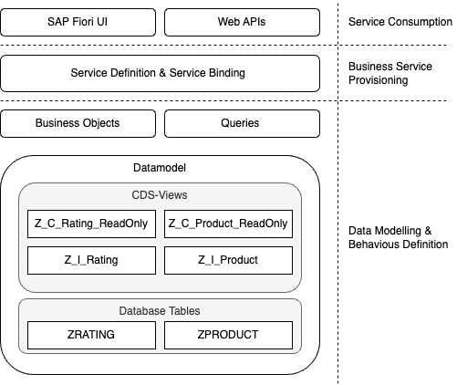
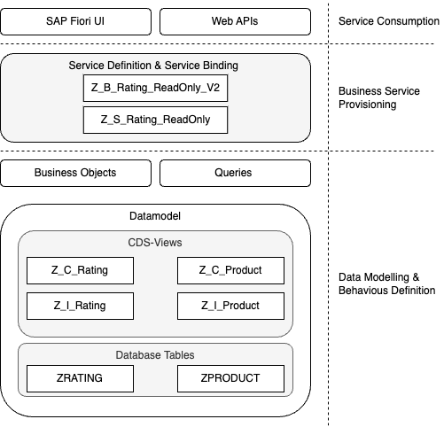
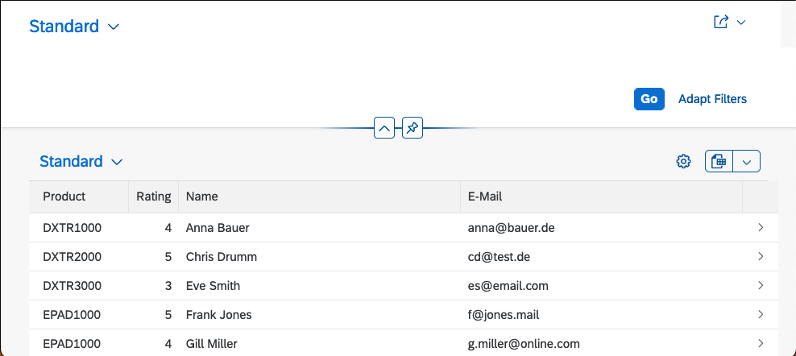
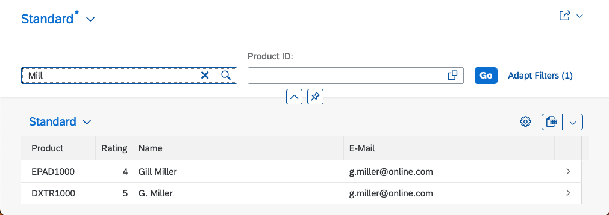
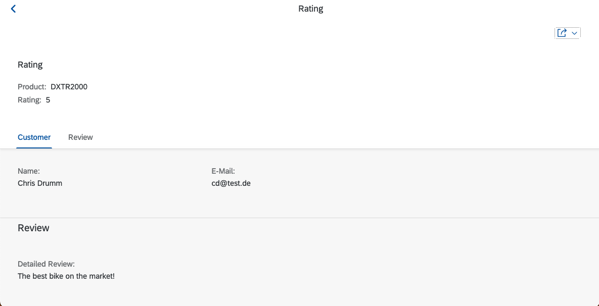
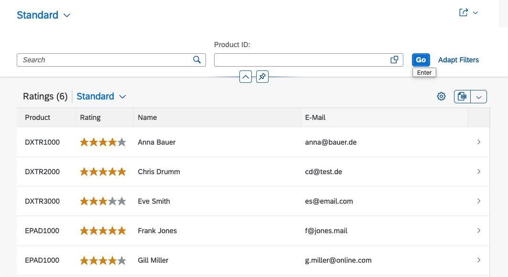
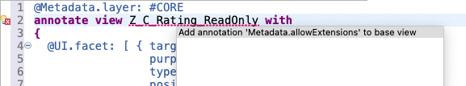

# Creating a Read-Only List Report

With the data model established, the next step involves creating a read-only list
report. This report allows the data of the business objects to be displayed using
an SAP Fiori app. To create a read-only list report, two steps are necessary.
First, _consumption views_ are created for the existing CDS views `Z_I_Product` and `Z_I_Rating`.
On the basis of the consumption views, a business service is created. Finally, the read-only list report
is created as an SAP Fiori app implemented using the
[SAP Fiori elements](https://experience.sap.com/fiori-design-web/smart-templates/) framework.

## Creating Consumption View

We will see later in this curriculum, that CDS views are the basis of business objects in RAP.
To enable flexibility, the business objects are not created on the basis of the interface views `Z_I_Product` and
`Z_I_Rating`. Instead, _consumption views_ are used to only expose the parts of the data model relevant in a
certain scenario.

While the _interface views_ provide a stable interface to the data model, the _consumption views_ provide
a use-case-specific projection of the data model.

The artifacts of the read-only list report from the data model will be stored in the package `Z_RATING_READONLY`.
Create this package as a sub-package of `Z_RATING`. Inside this package, the two consumption views
`Z_C_Product_ReadOnly` and `Z_C_Rating_ReadOnly` will be created. To create the consumption view
`Z_C_Product_ReadOnly`, create a new data definition. Provide `Z_C_Product_ReadOnly` as the name and
`Product View for the RO UI` as the description. Select `Z_I_Product` as the referenced object.
In the subsequent screen, select `Data Projection View` as the template and click `Finish`. This creates an
initial version of the consumption view. Use code completion (i.e. `<ctrl> - <space>`) to add all elements
of the interface view to the consumption view. The resulting source code of the view `Z_C_Product_ReadOnly` is
shown in the following listing.

```abap
@EndUserText.label: 'Product View for RO UI'
@AccessControl.authorizationCheck: #NOT_REQUIRED

define root view entity Z_C_Product_ReadOnly
  as projection on Z_I_Product
{
  key ProductId,
      ProductDescription,

      /* Associations */
      _Rating
}
```

The consumption view is defined as a `projection on Z_I_Product`. The projection specifies which parts of the interface view
`Z_I_Product` should be available in the consumption view. In this example, all elements of the interface view are
added to the consumption view.

Similarly, the consumption view `Z_C_Rating_ReadOnly` can be created. The listing below shows the resulting consumption view.
As before, all elements of the interface view are added to the consumption view.

```abap
@EndUserText.label: 'Rating view for RO UI'
@AccessControl.authorizationCheck: #NOT_REQUIRED

define view entity Z_C_Rating_ReadOnly
  as projection on Z_I_Rating
{
  key RatingUUID,
      Product,
      Name,
      Email,
      Rating,
      Review,
      /* Associations */
      _Product
}

```

The following figure illustrates the relationship between the development objects and the layers
of RAP.



## The Business Service Provisioning Layer

As shown in the RAP components diagram, the _Business Service Provisioning_ layer
separates business objects from service consumption. The business service provisioning layer contains two types of entities:

1. Service Definition
1. Service Binding.

The \_service definition'\_s role is to specify which business objects from the data
model are exposed. Different service definitions can be created for the same business
object to accommodate various consumption scenarios.

The _service binding_ connects a service (defined in a _service definition_) to a specific
communication protocol. Examples of available bindings include OData V2 and OData
V4. It is also possible to create different service bindings for different service definitions.

## Creating a Service Definition and a Service Binding

To create a service definition for the `Z_C_Rating_ReadOnly` entity,
right-click on the entity and select `New Service Definition`.


In the dialogue, enter `Z_S_Rating_ReadOnly` as the name of the service definition and
`Service for Read-Only UI` as the description. In the next screen, select a transport request and
click `Next>`. In the templates screen, select the `Define Service` template and click `Finish`.

Below is the code of the service definition.

```abap
@EndUserText.label: 'Service for Read Only UI'
define service Z_S_Rating_ReadOnly {
  expose Z_C_Rating_ReadOnly;
  expose Z_C_Product_ReadOnly;
}
```

The service [exposes](https://help.sap.com/doc/abapdocu_latest_index_htm/latest/en-US/index.htm?file=abensrvd_define_service.htm)
two entities from the data model: `Z_C_Rating_ReadOnly` and `Z_C_Product_ReadOnly`.

To create a service binding for the service definition, right-click on the `Z_S_RATING_READONLY` service and
select `New Service Binding`.
In the dialogue, enter `Z_B_RATING_READONLY_V2` as the name of the service definition and
`Rating Service - UI V2` as the description. For the binding type select `OData V2 UI`. In the next screen select a transport request and
click `Finish` and activate the binding.

The resulting binding is shown in the following screenshot.


Note that after creating a service binding, the service is not yet published. This means that the
service can not be accessed. To publish the service, click on the `Publish local service endpoint` link. This
generates the necessary artefacts for the service to be accessible. Once the publishing has been completed, activate
the service again.

Publishing the service results in two changes in the service binging:

- A `Service URL` is shown in the binding
- The `Preview` button becomes active.


Clicking on the `Service URL` opens the created OData service in the browser. It is now already possible
to query this service using the OData protocol.

### Exercise 1

Read the example data from the database using the OData service. Try to read rating and product data. Try to filter the
returned data, for example, only read reviews for a certain product.

### Different Service Binding Protocol Options

When creating a service binding, different protocol options are available. The
[RAP documentation](https://help.sap.com/docs/btp/sap-abap-restful-application-programming-model/service-binding)
provides the following recommendations for choosing the appropriate option:

> **UI service**
>
> A UI service makes it possible to add an SAP Fiori elements UI or other UI clients to the service.
> Currently, UI services are supported for OData and InA services.
>
> **Web API**
>
> A service that is exposed as Web API is used for all other use cases apart from
> UIs. Web APIs can be consumed by an unknown consumer via OData. Web APIs can be extended.
> Currently, Web APIs are supported for OData and SQL services.

Whether to use OData V2 or OData V4 depends also on the focus of the service. Regarding OData v4 the SAP documentation states:

> OData V4 services have a wider scope than OData V2 services. Use OData V4 wherever possible for transactional services.

However, not all features of SAP Fiori elements are available for OData V4. Therefore the OData V2 option is used in this unit.

The following diagram illustrates the different development objects and their relation to the RAP layers.
Obviously, the service definition and service binding belong to the _Business Service Provisioning_ layer.



### Previewing the Service

With the service published, it is now possible to preview the data using SAP Fiori elements.
The screenshot below displays the result of executing the preview for `Z_C_Rating_ReadOnly`.


The preview does not show any data. The reason is, that currently, no definition exists for which data of the
entity should be displayed and which not. In one of the subsequent steps, this information is added to the CDS view
defining the entity. Until then, it is possible to manually select the data to be displayed. This is done by clicking on the
gear icon. This opens the `View Settings` dialog. Here, the columns to display can be selected.

The preview does not show any data because there is currently no definition specifying
which data of the entity should be displayed. This information will be added to the
CDS view defining the entity in subsequent steps. Until then, it is possible to manually
select the data to be displayed by clicking on the gear icon, which opens the _View
Settings_ dialog. Here, you can choose the columns to display.


Selecting all available columns and also sorting the table by `Product ID` results in the data being displayed as shown below.


Note that the SAP Fiori elements app already provides several useful features, such as
the ability to resize columns, change the sort order, filter by clicking on the column
header, and export to MS Excel.

## Adding UI Annotations

As previously mentioned, the SAP Fiori app in this tutorial is built using the
[SAP Fiori elements](https://experience.sap.com/fiori-design-web/smart-templates/) framework.
This framework offers different floorplans to create apps for
various use cases. Currently, SAP Fiori elements provides the following floorplans:

- List Report
- Work list
- Object Page
- Overview Page
- Analytics List Page.

Examples of the different floorplans can be found [here](https://experience.sap.com/fiori-design-web/smart-templates/#supported-floorplans).
In this unit, a read-only list report for displaying rating data is developed, so
the list report floorplan serves as the basis for this app.

Each of the SAP Fiori elements floorplans offers a wide range of features. Identifying
the correct feature to implement a specific requirement can sometimes be challenging.
Fortunately, SAP has created the [SAP Fiori Element Feature Showcase App](https://github.com/SAP-samples/abap-platform-fiori-feature-showcase).
This app demonstrates all available features and provides code examples for their usage. Moreover,
the [Wiki of the Feature Showcase App](https://github.com/SAP-samples/abap-platform-fiori-feature-showcase/wiki/Feature-Showcase-App-Guide)
offers a useful search functionality.

In the following sections, various features are added to the read-only list report using CDS annotations.

### Defining Search Result Columns

Currently, users must manually add the displayed columns to the list report each
time the app preview starts. The first step is to define which columns appear in
the search result table. To add a field of a CDS view as a column to the search result
table, use the `@UI.lineItem` annotation. The position of the column can be defined
with `@UI.lineItem.position`, while `@UI.lineItem.label` sets the column's label.
`@UI.lineItem.importance` determines the importance of the columns, with less important
columns hidden first when the app is opened on a smaller screen (for example, a mobile phone
). Finally, `@UI.lineItem.type` defines how the column is displayed, with possible
values being `#STANDARD` for normal values or `#WITH_URL` for columns containing external
links.

The following listings show the annotation of the `Product` field with the position
`10`, importance `#HIGH`, and type `#STANDARD`. Note that code completion in ABAP in Eclipse
is beneficial for creating these annotations.

```abap
@UI:{
  lineItem: [{
    position: 10,
    importance: #HIGH,
    type: #STANDARD,
    label: 'Product'
  }]
}
```

It might also be necessary to hide certain fields in the UI. For example, the `RatingUUID` in this example
is not useful to any user and should therefore be hidden. Hiding a field can be achieved by using the `@UI.hidden: true` annotation.

The listing below shows possible annotations for the fields of the `Z_C_Rating_ReadOnly` view.

```abap

@EndUserText.label: 'Rating view for RO UI'
@AccessControl.authorizationCheck: #NOT_REQUIRED

define view entity Z_C_Rating_ReadOnly
  as projection on Z_I_Rating
{
    @UI.hidden: true
  key RatingUUID,

      @UI:{
        lineItem: [{
          position: 10,
          importance: #HIGH,
          type: #STANDARD,
          label: 'Product'
        }]
      }
      Product,

     @UI:{
       lineItem: [{
         position: 30,
         importance: #MEDIUM,
         type: #STANDARD,
         label: 'Name'
       }]
      }
      Name,

      @UI:{
        lineItem: [{
          position: 40,
          importance: #MEDIUM,
          type: #STANDARD,
          label: 'E-Mail'
        }]
      }
      Email,

      @UI:{
        lineItem: [{
          position: 20,
          importance: #HIGH,
          type: #STANDARD,
          label: 'Rating'
        }]
      }
      Rating,

      Review,

      /* Associations */
      _Product
}

```

With those annotations, the preview of the read-only list report looks as shown in the following screenshot.



### Adding Search Capabilities

Currently, the app doesn't provide any search functionality to find specific reviews,
other than manually scrolling through the result list. To address this, search
capabilities are being added to the list report.

To enable search capabilities for a CDS entity, the entity needs to be annotated
with `@Search.searchable: true`.

```abap
@Search.searchable: true
define view entity Z_C_Rating_ReadOnly
...
```

Next, all fields that should be searchable need to be annotated with `@Search.defaultSearchElement: true`.
Additionally, you can specify a threshold for the required similarity of
the search results to the search string. A similarity threshold of 1.0 means that
the result and search term are identical.

```abap
...
@Search.defaultSearchElement: true
@Search.fuzzinessThreshold : 0.8
Product,
...
```

Finally, it is possible to add a dedicated selection field using the `@UI.selectionField.position` annotation.
The resulting CDS entity, including the annotations, is shown in the following listing.

```abap
@Search.searchable: true
define view entity Z_C_Rating_ReadOnly
  as projection on Z_I_Rating
{
      @UI.hidden: true
  key RatingUUID,

      @UI:{
        selectionField: [{position: 10 }],
        lineItem: [{
          position: 10,
          importance: #HIGH,
          type: #STANDARD,
          label: 'Product'
        }]
      }
      @Search.defaultSearchElement: true
      @Search.fuzzinessThreshold : 0.8
      Product,

      @UI:{
        lineItem: [{
          position: 30,
          importance: #MEDIUM,
          type: #STANDARD,
          label: 'Name'
        }]
      }
      @Search.defaultSearchElement: true
      @Search.fuzzinessThreshold : 0.8
      Name,

      @UI:{
        lineItem: [{
          position: 40,
          importance: #MEDIUM,
          type: #STANDARD,
          label: 'E-Mail'
        }]
      }
      @Search.defaultSearchElement: true
      Email,

      @UI:{
        lineItem: [{
          position: 20,
          importance: #HIGH,
          type: #STANDARD,
          label: 'Rating'
        }]
      }
      Rating,

      Review,
      /* Associations */
      _Product
}

```

The following screenshot shows the resulting SAP Fiori App.



#### Exercise 2

Try testing different search strings and search annotation variants (for example, threshold
value) to see their effects. Also, check which UI adaptation features, such as adding
or removing result columns or reordering columns, still work.

### Adding Object Page Annotations

Although the current version of the app allows users to navigate to the details of
a review, the object page (i.e., the page that displays the details) is currently
empty. In the next step, annotations are used to add information to the object page.

The `@UI.headerInfo.typeName` and `@UI.headerInfo.typeNamePlural` annotations can be used to add a title to the result table and the
object page.

```abap
@UI: {
 headerInfo: { typeName: 'Rating',
               typeNamePlural: 'Ratings' } }
```

Using `@UI.facet` sub-sections for the object page can be defined. The following code snippet shows the creation of a header and a standard facet.

```abap
@UI.facet: [
  { targetQualifier: 'fRating',
    purpose:  #HEADER,
    type:     #IDENTIFICATION_REFERENCE,
    label:    'Rating',
    position: 10 },

  { targetQualifier: 'fCustomer',
    purpose:  #STANDARD,
    type:     #IDENTIFICATION_REFERENCE,
    label:    'Customer',
    position: 20 }
]
```

Using `@UI.identification` annotations, data can be added to these facets. For example, the following snippet shows how the `name` field
can be added to the `fCustomer` facet.

```abap
@UI:{
   ...
      identification: [{
        position: 10,
        label: 'Name',
        qualifier: 'fCustomer'
      }]
    }
    ...
Name
```

The resulting code, including the additional annotations for the object page, is shown in the following listing.

```abap
@EndUserText.label: 'Rating view for RO UI'
@AccessControl.authorizationCheck: #NOT_REQUIRED

@UI: {
 headerInfo: { typeName: 'Rating',
               typeNamePlural: 'Ratings' } }

@Search.searchable: true
define view entity Z_C_Rating_ReadOnly
  as projection on Z_I_Rating
{
      @UI.facet: [ { targetQualifier: 'fRating',
                     purpose:  #HEADER,
                     type:     #IDENTIFICATION_REFERENCE,
                     label:    'Rating',
                     position: 10 },

                     { targetQualifier: 'fCustomer',
                     purpose:  #STANDARD,
                     type:     #IDENTIFICATION_REFERENCE,
                     label:    'Customer',
                     position: 20 },

                     { targetQualifier: 'fReview',
                     purpose:  #STANDARD,
                     type:     #IDENTIFICATION_REFERENCE,
                     label:    'Review',
                     position: 30 }]

      @UI.hidden: true
  key RatingUUID,

      @UI:{
        selectionField: [{position: 10 }],
        lineItem: [{
          position: 10,
          importance: #HIGH,
          type: #STANDARD,
          label: 'Product'
        }],
        identification: [{
          position: 10,
          label: 'Product',
          qualifier: 'fRating'
        }]
      }
      @Search.defaultSearchElement: true
      @Search.fuzzinessThreshold : 0.8
      Product,

      @UI:{
        lineItem: [{
          position: 30,
          importance: #MEDIUM,
          type: #STANDARD,
          label: 'Name'
        }],
        identification: [{
          position: 10,
          label: 'Name',
          qualifier: 'fCustomer'
        }]
      }
      @Search.defaultSearchElement: true
      @Search.fuzzinessThreshold : 0.8
      Name,

      @UI:{
        lineItem: [{
          position: 40,
          importance: #MEDIUM,
          type: #STANDARD,
          label: 'E-Mail'
        }],
        identification: [{
          position: 20,
          label: 'E-Mail',
          qualifier: 'fCustomer'
        }]
      }
      @Search.defaultSearchElement: true
      Email,

      @UI:{
        lineItem: [{
          position: 20,
          importance: #HIGH,
          type: #STANDARD,
          label: 'Rating'
        }],
        identification: [{
          position: 20,
          label: 'Rating',
          qualifier: 'fRating'
        }]
      }
      Rating,

      @UI:{

        identification: [{
          position: 10,
          label: 'Detailed Review',
          qualifier: 'fReview'
        }]
      }

      Review,
      /* Associations */
      _Product
}
```

The resulting object page for a rating is shown in the following screenshot.



### Beautifying the App

The aim of this step is to improve the usability of the app. This can also be achieved using
annotation. First, the customer rating of a product should not be displayed as a number, but
as a rating indicator with little stars. This requires two steps:

1. Definition of a data point
1. Referencing the data point

To display the star rating in the search result table of the list view, a data point
is created for the Rating field using the following code. This creates a data point
that is displayed as a rating. The maximum possible value of the rating is 5, and
the data point is created for the `Rating` field (`qualifier: 'Rating'`).
In addition, the `type` attribute of the `lineItem` annotation needs to be changed to
`#AS_DATAPOINT` to use the data point in the result list.

```abap
...
  @UI:{
    identification: [{
      position: 20,
      label: 'Rating',
      qualifier: 'fRating'
    }],
    lineItem: [{
      position: 20,
      importance: #HIGH,
      type: #AS_DATAPOINT,
      label: 'Bewertung'
    }],
    dataPoint: {
      qualifier: 'Rating',
      targetValue: 5,
      visualization: #RATING
    }
  }
  Rating,
...
```

After adding this data point annotation, the result table of the list report is displayed
with the rating shown as stars, as shown in the following screenshot:



#### Exercise 3

To display the rating as stars on the object page as well, additional annotations need to be added.
Try to add these annotations yourself. The
[documentation on data points](https://github.com/SAP-samples/abap-platform-fiori-feature-showcase/wiki/Feature-Showcase-App-Guide#data-points)
from the SAP Fiori Elements Feature Showcase Wiki might be helpful.

Now, the value help for the `Product` search should be improved. Currently, it is not possible to
select values from the `ZPRODUCT` table. To enable this, a
[value help](https://github.com/SAP-samples/abap-platform-fiori-feature-showcase/wiki/Feature-Showcase-App-Guide#value-help)
annotation needs to be added. The following code snippet shows how to add a value help to the `Product` field
of the `Z_C_Rating_ReadOnly` CDS view.

This value help references the `Z_C_Product_ReadOnly` entity and uses `ProductId` element as the basis for possible values.

Currently, it is not possible to select values from the `ZPRODUCT` table in the `Product`
search. To enable this,
a [value help](https://github.com/SAP-samples/abap-platform-fiori-feature-showcase/wiki/Feature-Showcase-App-Guide#value-help)
annotation needs to be added. The following code snippet shows how to add a value help to the `Product` field of the `Z_C_Rating_ReadOnly` CDS view:

```abap
@Consumption.valueHelpDefinition: [{
   entity: {
       name: 'Z_C_Product_ReadOnly',
       element: 'ProductId'}}]
 Product;
```

This value help references the `Z_C_Product_ReadOnly` entity and uses the `ProductId`
element as the basis for possible values.

## Extracting Metadata

One issue with the current implementation of the CDS entity `Z_C_Rating_ReadOnly` is
that the definition of the business object and annotations specifying the presentation
of the data on the UI are mixed. This contradicts the [Separation of Concerns](https://en.wikipedia.org/wiki/Separation_of_concerns) principle.
Metadata extensions offer the possibility of extracting the UI annotations into a
separate artifact.

To create a metadata extension, right-click the source code of the `Z_C_Rating_ReadOnly`
entity and select `Source Code > Extract Metadata Extension`. Give the extension the
same name as the CDS entity (i.e., `Z_C_Rating_ReadOnly`) and add `Metadata extension`
for `Z_C_Rating_ReadOnly`as the description. On the subsequent screen of the dialog,
select all elements to extract the annotations for all of them, and click`Finish`.
The annotations are automatically extracted into the new metadata extension. Note
that not all annotations are extracted. Only the annotations on the element level
are extracted; the ones on the entity level (for example, `@Search.searchable`) are not extracted.

For the metadata extension, a layer needs to be specified. Use `#CORE` for this example.
The `#CUSTOMER` layer has the highest priority, while the `#CORE` layer has the lowest
priority. This can be used, for example, by customers to adapt the annotations to
their needs.

For the metadata extension to become active, the annotation `@Metadata.allowExtensions`
needs to be added to the CDS entity `Z_C_Rating_ReadOnly`. This annotation can be added
using a quick fix on the metadata extension.



Once this annotation is added, the entity and the metadata extension can be activated.
Extracting the annotations into a metadata extension has the following effect:

- The app works as before
- The `Z_C_Rating_ReadOnly` entity does not contain any UI-related annotations.

## References

- [SAP Fiori Element Feature Showcase App for the ABAP RESTful Application Programming Model](https://github.com/SAP-samples/abap-platform-fiori-feature-showcase)
- [Searchable Wiki of the Feature Showcase App](https://github.com/SAP-samples/abap-platform-fiori-feature-showcase/wiki/Feature-Showcase-App-Guide)

---

[< Previous Chapter](./data_model.md) | [Next Chapter >](./transactional_app.md) | [Overview 🏠](../README.md)
