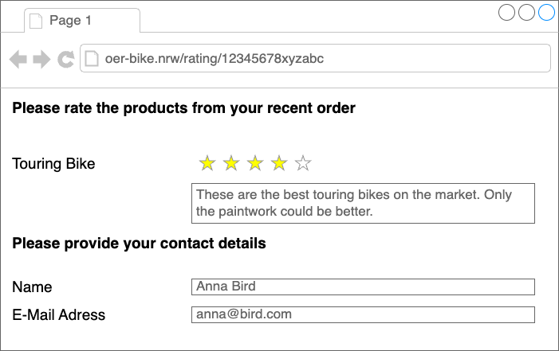
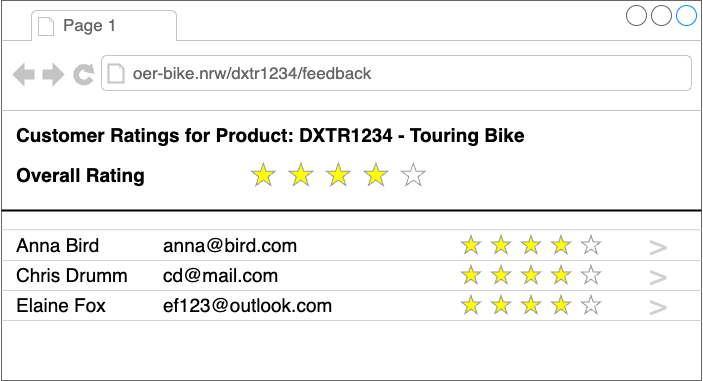
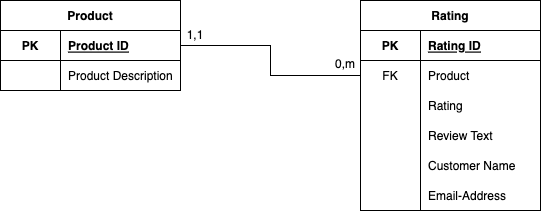

# Scenario Description

This section describes the scenario and business process that are the
basis for this curriculum.

## Customer Rating for Products

OER Bike wants to offer its customers the possibility to provide feedback to the products. This feedback
should consist of a rating of the product from 0 to 5 and an optional description of the rating. This
is a feedback approach common to many well known e-commerce web sites. Customers should
only be allowed to rate products the ordered.

The following images shows a mock up of possible user interface for the customers.

In addition to that OER Bike wants to allow the product managers of the different products to review the
feedback provided by the customers. Therefore, the product managers need a different user interface.
In order to analyse the user feedback for a given product the product manager enters one of OER Bike's
products and gets a list of all the reviews provided by the customers.

The following image shows a mock up of the possible user interface for product managers.

OER Bike wants to implement the described functionality as an extension to their SAP S/4HANA systems.

### Exercise 1

In the previous lecture you learned about different extension technologies in SAP S/4HANA.
Discuss how the functionality described above could be implemented using these technologies.
What are the advantages and disadvantages of the different approaches?

## Extension Architecture

OER Bike decided to implement the functionality described above using a custom application in the
SAP BTP ABAP environment using the SAP ABAP RAP framework. Withing OER Bike the whole project as well
the developed applications is simply
called _the Rating App_.

The basis for the Rating App is the data model shown in the following diagram.

The data model consists of two tables:

- Product: containing the basic information of OER Bike's products
- Rating: containing the customer ratings of the products.

There is a one to many relation between the entries in the product table and the entries in the rating table.
Therefore, for every product multiple ratings can be stored.

> Note that the data model of the Rating App is very simplistic. It is only intended
> to provide a solid basis for introducing the SAP ABAP RAP framework.
> In reality the data model of a Rating App would probably be much more complex.

### Exercise 2

- Discuss which fields are necessary in the tables in the Rating App in order
  to provide the described functionality.
- Analyse the fields of different tables of an SAP S/4HANA system. Which fields are
  present there? Would you add additional files to the tables after the analysis?
