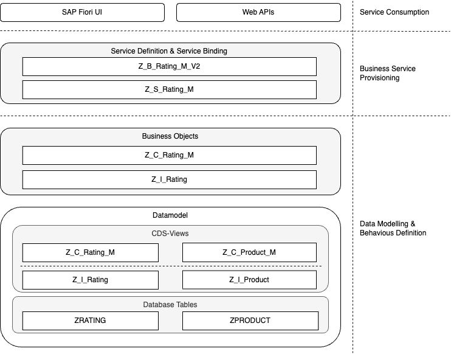

# Creating a Transactional App

In the previous unit, an app was created to only display data.
In this unit, the focus is on creating a transactional app, i.e. an app that can be used
to create, change, and delete data. To develop the transactional app, the
[Managed Transaction App](https://help.sap.com/docs/ABAP_PLATFORM_NEW/fc4c71aa50014fd1b43721701471913d/b5bba99612cf4637a8b72a3fc82c22d9.html)
approach is used.

## Preparations

To separate the transaction app nicely from the read-only list report, a little bit of preparation is required.
On the basis of the interface views in the package `Z_RATING_DB`, new consumption views and corresponding service
definitions and bindings are created. Those are the basis of the transactional app developed in this unit.
The following steps are necessary for preparation:

1. Create a package for the transactional app
1. Create two new consumption views and the corresponding metadata extensions
1. Create a service definition and service binding for the transactional app.

Steps 2 and 3 are basically repetitions of the previous unit. Technically, this would not be necessary.
This approach is used in this curriculum to preserve results from previous units for later reference.

First, create a package with the name `Z_RATING_MANAGED` as a sub-package of the existing `Z_RATING` package.

### Create New Consumption Views

Inside the new package, create the consumption view `Z_C_Product_M` for the root entity `Z_I_Product`. The source
code of the consumption view is shown below. Most parts of this view are similar to what was discussed in the
previous unit. The main difference is the `_Rating : redirected to composition child Z_C_Rating_M` statement.
This statement specifies that the association `_Rating` should not use the entity `Z_I_Rating` specified in the
`Z_I_Product` entity. Instead, the association should be mapped to an entity named `Z_C_Rating_M`, which is created next.

The reason for this redirection is that different consumption views could use different projections in the associations to
cater for different usage scenarios.

```abap
@UI: {
 headerInfo: { typeName: 'Product',
               typeNamePlural: 'Products',
               title: { type: #STANDARD, value: 'ProductId' }} }

@Search.searchable: true

@Metadata.allowExtensions: true
define root view entity Z_C_Product_M
  as projection on Z_I_Product
{
  key ProductId,
      ProductDescription,
      /* Associations */
      _Rating : redirected to composition child Z_C_Rating_M
}
```

The source code for the `Z_C_Rating_M` consumption view is shown below. Again, the only difference to
the previous unit is the redirection of the `_Product` association to the `Z_C_Rating_M` consumption view.

```abap
@UI: {
 headerInfo: { typeName: 'Rating',
               typeNamePlural: 'Ratings',
               title: { type: #STANDARD, value: 'Product' } } }

@Search.searchable: true
@Metadata.allowExtensions: true
define view entity Z_C_Rating_M
  as projection on Z_I_Rating
{
  key RatingUUID,
      Product,
      Name,
      Email,
      Rating,
      Review,
      CreatedBy,
      CreatedAt,
      LastChangedBy,
      LastChangedAt,
      /* Associations */
      _Product : redirected to parent Z_C_Product_M
}
```

### Create New Metadata Extensions

Next, new metadata extensions are created for the two consumption views. Again, the
metadata extension should be named like the consumption view. Below is the code for the
metadata extension for the `Z_C_Rating_M`.
This code does not contain any new features. Everything should be understandable from
the discussion in the previous unit.

Note that this version of the metadata extension for `Z_C_Rating_M` adds all available fields
to the UI.

```abap
@Metadata.layer: #CORE
annotate view Z_C_Rating_M with
{

  @UI.facet: [ { id:       'idRating',
                 purpose:  #STANDARD,
                 type:     #IDENTIFICATION_REFERENCE,
                 label:    'Rating',
                 position: 10 } ]

  @UI.identification: [{ position: 10 }]
  @UI.selectionField: [{ position: 10 }]
  @UI.lineItem: [{ position: 10 }]
  RatingUUID;

  @UI.identification: [{ position: 20 }]
  @UI.selectionField: [{ position: 20 }]
  @UI.lineItem: [{ position: 20 }]
  @Search.defaultSearchElement: true
  Product;

  @UI.identification: [{ position: 30, label: 'Name' }]
  @UI.selectionField: [{ position: 30 }]
  @UI.lineItem: [{ position: 30 }]
  Name;

  @UI.identification: [{ position: 40, label: 'Email' }]
  @UI.selectionField: [{ position: 40 }]
  @UI.lineItem: [{ position: 40 }]
  Email;

  @UI.identification: [{ position: 50, label: 'Rating' }]
  @UI.selectionField: [{ position: 50 }]
  @UI.lineItem: [{ position: 50 }]
  Rating;

  @UI.identification: [{ position: 60, label: 'Review' }]
  @UI.selectionField: [{ position: 60 }]
  @UI.lineItem: [{ position: 60 }]
  Review;

  @UI.identification: [{ position: 50 }]
  @UI.selectionField: [{ position: 50 }]
  @UI.lineItem: [{ position: 50, label: 'Created By'}]
  CreatedBy;

  @UI.identification: [{ position: 60 }]
  @UI.selectionField: [{ position: 60 }]
  @UI.lineItem: [{ position: 60, label: 'Created At' }]
  CreatedAt;

  @UI.identification: [{ position: 70 }]
  @UI.selectionField: [{ position: 70 }]
  @UI.lineItem: [{ position: 70, label: 'Changed By' }]
  LastChangedBy;

  @UI.identification: [{ position: 80 }]
  @UI.selectionField: [{ position: 80 }]
  @UI.lineItem: [{ position: 80, label: 'Changed At' }]
  LastChangedAt;
}
```

The next code snippet contains the source code for the `Z_C_Product_M` metadata extension.
The interesting part of this is the `@UI.facet` annotation of the `_Rating` element. This
annotation is of `type: #LINEITEM_REFERENCE`. It adds a table of all ratings for a product to
the object page of the product. The effect of this annotation will become visible as soon as
the app can be previewed.

```abap
@Metadata.layer: #CORE
annotate view Z_C_Product_M with

{
  @UI.facet: [ { id:       'idProduct',
                 purpose:  #STANDARD,
                 type:     #IDENTIFICATION_REFERENCE,
                 label:'Product',
                 position: 10 }]

  @UI:{
    lineItem: [{
        position: 10,
        importance: #HIGH,
        type: #STANDARD,
        label: 'Product ID'
    }],
    identification: [{
        position: 10,
        label: 'Product ID'
    }]
  }
  @Search.defaultSearchElement: true
  ProductId;
  @UI:{
    lineItem: [{
        position: 20,
        importance: #HIGH,
        type: #STANDARD,
        label: 'Product Description'
    }],
    identification: [{
        position: 20,
        label: 'Product Description'
    }]
  }
  @Search.defaultSearchElement: true
  ProductDescription;

  @UI.facet: [{ id: 'idRatings',
                purpose: #STANDARD,
                type: #LINEITEM_REFERENCE,
                label: 'Product Ratings',
                targetElement: '_Rating',
                position: 20 } ]
  _Rating;
}

```

### Creating New Service Definitions and Bindings

The final step of the preparation is to create service definitions and bindings for
the new consumption views. The following code snippet shows the source code of
the service definition `Z_S_Rating_M`.
Both consumption views are published. The consumption view `Z_C_Rating_M` is published as
`Rating` and the consumption view `Z_C_Product_M` is published as `ProductManager`.

```abap
@EndUserText.label: 'Service for Managed Scenario'
define service Z_S_Rating_M {
  expose Z_C_Rating_M as Rating;
  expose Z_C_Product_M as ProductManager;
}
```

Again, a service binding of the type `OData V2 - UI` needs to be created for the service definition.
Once the binding is published locally, the app preview of the `ProductManager` entity should look similar to
the screenshot below.


The selection of the product navigates to the object page of this product. This also shows the
ratings for this product. This is the result of the `type: #LINEITEM_REFERENCE` annotation mentioned before.


## Creating Behaviour Definitions

The result of the preparation steps is basically a new read-only list report.
Below is again the ABAP RAP components diagram. So far, the implementation of
the business objects in the components diagram has not been discussed in detail.


According to the [ABAP RAP documentation](https://help.sap.com/docs/ABAP_PLATFORM_NEW/fc4c71aa50014fd1b43721701471913d/a3ff9dcdb25a4f1a9408422b8ba5fa00.html), 
a business object consists of three elements:

> - a structure,
> - a behavior and
> - the corresponding runtime implementation.

This unit, defining just the structure of the business object, was enough. We did this by defining
database tables and CDS views on top of these tables. To create a transactional app, 
the behavior of a business object needs to be specified as well.
The following figure shows the relationship between the structure and the behavior of a business object.


The structure of a business object is defined using CDS. A Business object consists of
exactly one root entity and optional child entities. It is also possible for a business object to consist of
more than two levels. Child entities can again have child entities. As an example, consider a purchase order. A purchase order
consists of the purchase order head, which is modeled as the root entity. The purchase order items could be modeled as
child entities of the root node. For each item, there could be multiple schedule lines. These would be modeled as
child entities of the item node.

The behavior of a business object consists of the behavior definition and the corresponding runtime implementation.
A behavior definition is always related to exactly one root entity. The behavior of the child entities is defined in
the behavior definition of the root entity. The behavior definition is implemented using one or many behavior implementations.
A behavior implementation is an ABAP class that implements the necessary functionality.

### Creating Behaviour Definitions

To create the necessary behavior definitions, right-click on the interface view of the root entity, i.e. `Z_I_PRODUCT`, and select `New Behavior Definition`.
Change the package to `Z_RATING_MANAGES` and the description to `Behavior definition for Z_I_Product`. Make sure that _Root Entity_ contains the name of the
root entity, i.e. `Z_I_Product`in this example. Furthermore, the _Implementation Type_ needs to be `Managed`. Click `Next >` to select a transport request and
click `Finish` to create the behavior definition.

As a result, an initial behavior definition is created. From this behavior definition, delete both lines starting with `//etag`. In addition, specify the alias
`Product` for `Z_I_Product` and `Rating` for `Z_I_Rating`. The resulting behavior definition is shown below.
Ignore the warnings for the time being and activate the behavior.

```abap
managed implementation in class zbp_i_product unique;
strict ( 1 );

define behavior for Z_I_Product alias Product
persistent table zproduct
lock master
authorization master ( instance )
{
  create;
  update;
  delete;
  association _Rating { create; }
}

define behavior for Z_I_Rating alias Rating
persistent table zrating
lock dependent by _Product
authorization dependent by _Product
{
  update;
  delete;
  field ( readonly ) Product;
  association _Product;
}
```

Let's analyze the behavior definition.
The first line states that the behavior is implemented in the ABAP class `ZBP_I_PRODUCT`. Note that we have not created this class so far. Use the
available quick fix (i.e. the little light bulb; it can also be invoked by pressing `<ctrl>-1`) to create this class. Activate it afterward.

The lines starting with `persistent table` define the database tables in which the data is stored. This is needed for the create, update, and delete operations.
The lines starting with `lock` define the strategies for concurrency control. ABAP RAP supports optimistic and pessimistic concurrency control.
Details of the different approaches are described in the
[documentation](https://help.sap.com/docs/ABAP_PLATFORM_NEW/fc4c71aa50014fd1b43721701471913d/d315c13677d94a6891beb3418e3e02ed.html). In this example, 
pessimistic concurrency control is used. This means that business objects are locked for modification. Only one user is able to change a business object at a time.
The lines starting with `authorization` specify that the authorization for the business object is controlled by the root entity, the authorization master.

The available operations for each entity are defined within the curly braces. The following code snippets specify that:

1. Create, update, and delete operations are available for the `Z_I_Product` entity.
1. Child entities can be created via the `_Rating` association.

```abap
...
{
  create;
  update;
  delete;
  association _Rating { create; }
}
...

```

In contrast, only update and delete operations are available for the `Z_I_Rating` entity.
Furthermore, the foreign key `Product` is marked as read-only.

Executing the app preview currently does not show the effect of creating the behavior definition. The reason is that the service definition
publishes the `Z_C_Product_M` entity, a projection of the underlying `Z_I_Product` entity.
The RAP framework allows having different behavior definitions for different projections. Again, the reason is to cater to different usage
scenarios. In our example, there might be a projection that just allows viewing the ratings of a product, for example, for a prospective customer. A
second projection might allow changing and updating ratings, for example, to cater to the needs of a product manager.

To create the necessary projection of the behaviour definition, right-click on the `Z_C_Product_M` entity and select `New Behavior Definition`.
Make sure that the correct package is selected and that the _Implementation Definition_ is `Projection`. Again, add the aliases and activate the behavior definition.
The following listing shows the resulting behavior definition. The projection defines which of the available operations are used.

```abap
projection;
strict ( 1 );

define behavior for Z_C_Product_M alias Product
{
  use create;
  use update;
  use delete;

  use association _Rating { create; }
}

define behavior for Z_C_Rating_M alias Rating
{
  use update;
  use delete;

  use association _Product;
}
```

#### Exercise 1

Once the behavior projection has been activated, execute the app preview again.
What do you notice? Is new functionality available? Does everything work as expected?

### Adding a Mapping to the Behavior Definition

With the current behavior implementation, the app has a number of problems. Certain operations, like deleting a rating,
lead to error messages. The most severe error is that the creation of new entries results in corrupted data.
When creating a new product, the product Id is not stored. As the product ID is the primary key, only one new product can be created.

The reason for this error is that a mapping of the field names of the database tables was added to CDS entities.
Consider, for example, the entity `Z_I_Product`. The field `product_id` is renamed to `ProductId`, and the field `product_desc` to `ProductDescription`.

```abap
define root view entity Z_I_Product
  as select from zproduct
  composition [0..*] of Z_I_Rating as _Rating
{
  key product_id   as ProductId,
      product_desc as ProductDescription,
      _Rating
}

```

To enable the RAP framework to save and update the database tables, the mapping information needs to be added to the behavior as well. Note that
mapping is only necessary for the field where the name was changed by, for example, removing an underscore. Renaming `email` to `Email` does not require a mapping.
The source code below shows the behavior definition, including the necessary mappings information.
The `corresponding` keyword defines that components with the name (except in some cases, changes like in the example above) are mapped automatically.

```abap
managed implementation in class zbp_i_product unique;

define behavior for Z_I_Product alias Product
persistent table zproduct
lock master
{
  create;
  update;
  delete;
  association _Rating { create; }

  mapping for zproduct corresponding {
    ProductId = product_id;
    ProductDescription = product_desc;
  }
}

define behavior for Z_I_Rating alias Rating
persistent table zrating
lock dependent
{
  update;
  delete;
  field ( readonly ) Product;
  association _Product;

  mapping for zrating corresponding {
    RatingUUID = rating_uuid;
    LastChangedAt = last_changed_at;
    LastChangedBy = last_changed_by;
    CreatedAt = created_at;
    CreatedBy = created_by;
  }
}
```

#### Exercise 2

Test the resulting app again in the preview. Does creating and deleting records work now?
Are there still any problems with the app?

### Adding Automatic Numbering and Additional Field Controls

One possible issue with the app is currently that the `ProductId` can be changed after
the creation. The `ProductId` is the primary key in the `ZPRODUCT` table and should therefore never be changed after its initial creation. This can be achieved in RAP using
[field characteristics](https://help.sap.com/doc/abapdocu_cp_index_htm/CLOUD/en-US/index.htm?file=ABENBDL_FIELD_PROJECTION.htm).
One field characteristic is already present in the current behavior definition. The field `Product` of the `Z_I_Rating`
entity is marked as read-only.

To allow the `ProductId` to be specified during creation but not changed during an update, the following field characteristics need to be added.

```abap
field ( readonly : update ) ProductId;
```

Another problem with the current version of the app is that the primary key of a review needs to be entered manually. The primary
key is defined as a UUID. Entering UUIDs manually is obviously a bad user experience.
Using the [early numbering](https://help.sap.com/docs/ABAP_PLATFORM_NEW/fc4c71aa50014fd1b43721701471913d/399a5d5bd0d84c16a1cdc8c08e3ed701.html)
feature of RAP, UUIDs can be created automatically. To do this, the field needs to be:

- read only
- numbering is set to `managed`

This can be achieved by the following code snippet:

```abap
field ( readonly, numbering : managed ) RatingUUID;
```

The automatic creation of UUIDs requires the database field has the type `raw(16)`. Verify in the ABAP Development Tools that this is the case
for the `rating_uuid` field of table `ZRATING`.

Finally, the field `CreatedBy`, `CreatedAt`, `LastChangedBy`, and `LastChangedAt` should not be editable by the user. The field should be
filled automatically to always contain the correct information. The necessary annotations were added earlier to the `Z_I_Raring` entity. To disable manual editing of these fields, they should be set to read-only.

The resulting behavior definition is shown below.

```abap
managed implementation in class zbp_i_product unique;

define behavior for Z_I_Product alias Product
persistent table zproduct
lock master
{
  field ( readonly : update ) ProductId;

  create;
  update;
  delete;
  association _Rating { create; }

  mapping for zproduct corresponding {
    ProductId = product_id;
    ProductDescription = product_desc;
  }
}

define behavior for Z_I_Rating alias Rating
persistent table zrating
lock dependent
{
  field ( readonly, numbering : managed ) RatingUUID;
  field ( readonly ) LastChangedAt, LastChangedBy, CreatedAt, CreatedBy;

  update;
  delete;
  field ( readonly ) Product;
  association _Product;

  mapping for zrating corresponding {
    RatingUUID = rating_uuid;
    LastChangedAt = last_changed_at;
    LastChangedBy = last_changed_by;
    CreatedAt = created_at;
    CreatedBy = created_by;
  }
}
```

With this behavior definition, the app should not be working as expected. The following figure details
the elements comprising the rating app so far. In the next unit, additional behaviour is added to the app.



#### Exercise 3

One possible improvement to the current functionality of the app is to add mandatory fields. When creating a
rating, the fields `Name` and `Email`should be mandatory. Furthermore, these fields should not be changeable
after a rating is created. The rationale of this functionality is that a rating is created automatically once
an order is completed and sent to the customer. The customer only needs to provide the rating and an optional review.

With the knowledge from the previous sections, you should be able to implement this requirement now. The necessary information
to make a field mandatory is available in the [ABAP Documentation](https://help.sap.com/doc/abapdocu_cp_index_htm/CLOUD/en-US/index.htm?file=abenbdl_field_char.htm).

---

[< Previous Chapter](./ro_list_report.md) | [Next Chapter >](./adding_behavior.md) | [Overview 🏠](../README.md)
