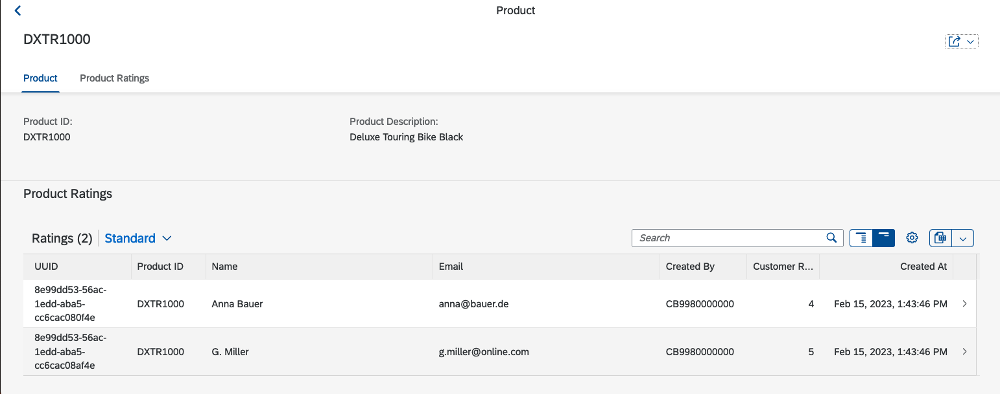
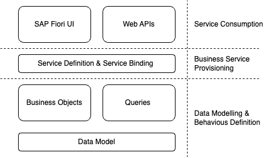
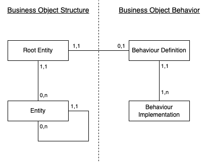

# Creating a Transactional App

In the previous chapter a app was created to only display data.
In this chapter the focus is on creating a transactional app, i.e. an app that can be used
to create, change and delete data. To develop the transactional app the
[Managed Transaction App](https://help.sap.com/docs/ABAP_PLATFORM_NEW/fc4c71aa50014fd1b43721701471913d/b5bba99612cf4637a8b72a3fc82c22d9.html)
approach is used.

## Preparations

In order to separate the transaction app nicely from the read-only list report a little bit of preparation is required.
On the basis of the interfaces views in the package `Z_RATING_DB` new consumption views and corresponding service
definitions and binding are created. Those are that basis of the transactional app developed in this unit.
The following steps are necessary as a preparation:

1. Create a package for the transactional app
1. Create two new consumption views and the corresponding metadata extensions
1. Create a service definition and service binding for the transactional app.

The steps 2 and 3 are basically a repetition of the previous unit. Technically, this would not be necessary.
The approach is used in this curriculum to preserve results from previous units for later reference.

First, create a package with the name `Z_RATING_MANAGED` as a sub-package of the existing `Z_RATING` package.

### Create new Consumption views

Inside the new package create the consumption view `Z_C_Product_M` for the root entity `Z_I_Product`. The source
code of the consumption view is shown below. Most parts of this view are similar to what was discussed in the
previous unit. The main difference is the `_Rating : redirected to composition child Z_C_Rating_M` statement.
This statement specifies, that the association `_Rating` should not used the entity `Z_I_Rating` specified in the
`Z_I_Product` entity. Instead the association should be mapped to a entity named `Z_C_Rating_M`, which is created next.

The reason for this redirection is, that different consumption views could use different projections in the associations to
cater for different usage scenarios.

```abap
@UI: {
 headerInfo: { typeName: 'Product',
               typeNamePlural: 'Products',
               title: { type: #STANDARD, value: 'ProductId' }} }

@Search.searchable: true

@Metadata.allowExtensions: true
define root view entity Z_C_Product_M
  as projection on Z_I_Product
{
  key ProductId,
      ProductDescription,
      /* Associations */
      _Rating : redirected to composition child Z_C_Rating_M
}
```

The source code for the `Z_C_Rating_M` consumption view is shown below. Again, the only difference to
the previous unit is the redirection of the `_Product` association to the `Z_C_Rating_M` consumption view.

```abap
@UI: {
 headerInfo: { typeName: 'Rating',
               typeNamePlural: 'Ratings',
               title: { type: #STANDARD, value: 'Product' } } }

@Search.searchable: true
@Metadata.allowExtensions: true
define view entity Z_C_Rating_M
  as projection on Z_I_Rating
{
  key RatingUUID,
      Product,
      Name,
      Email,
      Rating,
      Review,
      CreatedBy,
      CreatedAt,
      LastChangedBy,
      LastChangedAt,
      /* Associations */
      _Product : redirected to parent Z_C_Product_M
}
```

### Create new metadata extensions

Next new metadata extensions are created for the two consumptions views. Again the
metadata extension should be named like the consumption view. Below is the code for the
metadata extension for the `Z_C_Rating_M`.
This code does not contain any new features. Everything should be understandable from
the discussion in the previous unit.

Note that this version of the metadata extension for `Z_C_Rating_M` adds all available fields
to the UI.

```abap
@Metadata.layer: #CORE
annotate view Z_C_Rating_M with
{

  @UI.facet: [ { id:       'idRating',
                 purpose:  #STANDARD,
                 type:     #IDENTIFICATION_REFERENCE,
                 label:    'Rating',
                 position: 10 } ]

  @UI.identification: [{ position: 10 }]
  @UI.selectionField: [{ position: 10 }]
  @UI.lineItem: [{ position: 10 }]
  RatingUUID;

  @UI.identification: [{ position: 20 }]
  @UI.selectionField: [{ position: 20 }]
  @UI.lineItem: [{ position: 20 }]
  @Search.defaultSearchElement: true
  Product;

  @UI.identification: [{ position: 30, label: 'Name' }]
  @UI.selectionField: [{ position: 30 }]
  @UI.lineItem: [{ position: 30 }]
  Name;

  @UI.identification: [{ position: 40, label: 'Email' }]
  @UI.selectionField: [{ position: 40 }]
  @UI.lineItem: [{ position: 40 }]
  Email;

  @UI.identification: [{ position: 50, label: 'Rating' }]
  @UI.selectionField: [{ position: 50 }]
  @UI.lineItem: [{ position: 50 }]
  Rating;

  @UI.identification: [{ position: 60, label: 'Review' }]
  @UI.selectionField: [{ position: 60 }]
  @UI.lineItem: [{ position: 60 }]
  Review;

  @UI.identification: [{ position: 50 }]
  @UI.selectionField: [{ position: 50 }]
  @UI.lineItem: [{ position: 50, label: 'Created By'}]
  CreatedBy;

  @UI.identification: [{ position: 60 }]
  @UI.selectionField: [{ position: 60 }]
  @UI.lineItem: [{ position: 60, label: 'Created At' }]
  CreatedAt;

  @UI.identification: [{ position: 70 }]
  @UI.selectionField: [{ position: 70 }]
  @UI.lineItem: [{ position: 70, label: 'Changed By' }]
  LastChangedBy;

  @UI.identification: [{ position: 80 }]
  @UI.selectionField: [{ position: 80 }]
  @UI.lineItem: [{ position: 80, label: 'Changed At' }]
  LastChangedAt;
}
```

The next code snippet contains the source code for the `Z_C_Product_M` metadata extension.
The interesting part of this is the `@UI.facet` annotation of the `_Rating` element. This
annotation is of `type: #LINEITEM_REFERENCE`. It adds a table of all ratings for a product to
the object page of the product. The effect of this annotation will become visible as soon as
the app can be previewed.

```abap
@Metadata.layer: #CORE
annotate view Z_C_Product_M with

{
  @UI.facet: [ { id:       'idProduct',
                 purpose:  #STANDARD,
                 type:     #IDENTIFICATION_REFERENCE,
                 label:'Product',
                 position: 10 }]

  @UI:{
    lineItem: [{
        position: 10,
        importance: #HIGH,
        type: #STANDARD,
        label: 'Product ID'
    }],
    identification: [{
        position: 10,
        label: 'Product ID'
    }]
  }
  @Search.defaultSearchElement: true
  ProductId;
  @UI:{
    lineItem: [{
        position: 20,
        importance: #HIGH,
        type: #STANDARD,
        label: 'Product Description'
    }],
    identification: [{
        position: 20,
        label: 'Product Description'
    }]
  }
  @Search.defaultSearchElement: true
  ProductDescription;

  @UI.facet: [{ id: 'idRatings',
                purpose: #STANDARD,
                type: #LINEITEM_REFERENCE,
                label: 'Product Ratings',
                targetElement: '_Rating',
                position: 20 } ]
  _Rating;
}

```

### Creating new service definitions and bindings

The final step of the preparation is to create service definitions and bindings for
the new consumption views. The following code snippet shows the source code of
the service definition `Z_S_Rating_M`.
Both consumption views are published. The consumption view `Z_C_Rating_M` is published as
`Rating` and the consumption view `Z_C_Product_M` is published as `ProductManager`.

```abap
@EndUserText.label: 'Service for Managed Scenario'
define service Z_S_Rating_M {
  expose Z_C_Rating_M as Rating;
  expose Z_C_Product_M as ProductManager;
}
```

Again a service binding of the type `OData V2 - UI` needs to be created for the service definition.
Once the binding is published locally the app preview of the `ProductManager` entity should look similar to
the screenshot below.


Selection on of the product navigates to the object page of this product. This shows now also the
ratings for this product. This is the result of the `type: #LINEITEM_REFERENCE` annotation mentioned before.



## Creating Behaviour Definitions

The result of the preparation steps is basically a new read-only list report.
Below is again the ABAP RAP components diagram. So far the implementation of
the business objects in the components diagram was not discussed in detail.



According to the [ABAP RAP documentation](https://help.sap.com/docs/ABAP_PLATFORM_NEW/fc4c71aa50014fd1b43721701471913d/a3ff9dcdb25a4f1a9408422b8ba5fa00.html)
a business object consist of three elements:

> - a structure,
> - a behavior and
> - the corresponding runtime implementation.

Unit this unit defining just the structure of the business object was enough. We did this by defining
database tables and CDS views on top of these tables. In order to create a transactional app
the behavior of a business object needs to be specified as well.
The following figure shows the relation between the structure and the behavior of a business object.



The structure of a business object is defined using CDS. A Business object consists of
exactly one root entity and optional child entities. It is also possible for a business object to consists of
more than two levels. Child entities can again have child entities. As an example consider a purchase order. A purchase order
consist of the purchase order head, which is modelled as the root entity. The purchase order items could be modelled as
child entities of the root node. For each item there could be multiple schedule lines. These would be modelled as
child entities of the item node.

The behavior of a business object consist of the behaviour definition and the corresponding runtime implementation.
A behaviour definition is always related to exactly one root entity. The behavior of the child entities is defined in
the behavior definition of the root entity. The runtime implementation of the behavior is implemented using ABAP classes.

```abap
managed implementation in class zbp_i_product unique;

define behavior for Z_I_Product alias Product
persistent table zproduct
lock master
//etag master <field_name>
{
  field ( readonly : update ) ProductId;

  create;
  update;
  delete;
  association _Rating { create; }

  mapping for zproduct corresponding {
    ProductId = product_id;
    ProductDescription = product_desc;
  }
}

define behavior for Z_I_Rating alias Rating
persistent table zrating
lock dependent
etag master LastChangedAt
{
  field ( readonly, numbering : managed ) RatingUUID;
  field ( readonly ) LastChangedAt, LastChangedBy, CreatedAt, CreatedBy;

  update;
  delete;
  field ( readonly ) Product;
  association _Product;

  mapping for zrating corresponding {
    RatingUUID = rating_uuid;
    LastChangedAt = last_changed_at;
    LastChangedBy = last_changed_by;
    CreatedAt = created_at;
    CreatedBy = created_by;
  }
}
```

```abap
projection;

define behavior for Z_C_PRODUCT_M alias Product
{
  use create;
  use update;
  use delete;
  use association _Rating { create; }
}

define behavior for Z_C_RATING_M alias Rating {
	use update;
    use delete;
	use association _Product { }
}
```

---

[< Previous Chapter](./ro_list_report.md) | [Next Chapter >](./adding_behaviour.md) | [Overview 🏠](../README.md)
